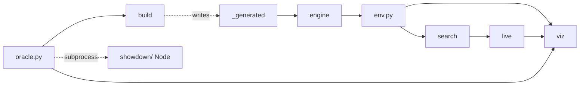
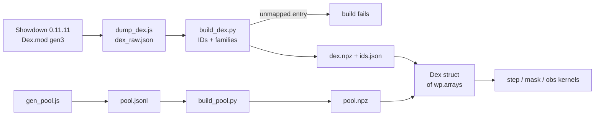
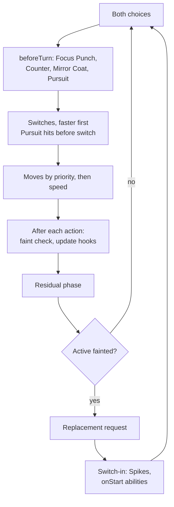
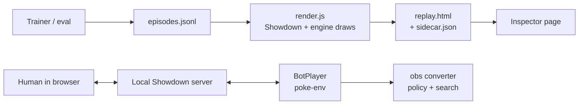

# Gen 3 Random Battle GPU Engine — Spec

The design, and the source of truth: code that has to contradict it changes it in the same commit. What has been measured is in [RESULTS.md](RESULTS.md).

## Scope

A GPU battle engine for Showdown's [Gen 3] Random Battle, singles only, written in NVIDIA Warp. Target is parity with Showdown pinned at `pokemon-showdown` 0.11.11, not cartridge accuracy, because the agent plays on Showdown.

**Goals**

- Parity: identical canonical state after every decision point, given the same RNG draws as Showdown.
- Throughput: beat a JAX `vmap`/`lax.switch` baseline on the divergence microbenchmark at batch 1K–65K.
- Small code: behavior as data wherever possible. Estimate: 3–5K lines of Warp plus ~500 lines of build script.
- Search support: fork, canonical hash, and chance-outcome enumeration as first-class operations.

**Non-goals**

- Other generations, other formats, doubles.
- Team validation and on-GPU team generation. Teams are pre-generated on CPU by Showdown.
- Protocol text or logs in release builds. Gradients (`enable_backward=False`).

**Rules with runtime effect** (from the `gen3randombattle` rule table): Sleep Clause Mod, Switch Priority Clause Mod, Endless Battle Clause. Species, OHKO and evasion clauses only validate teams. HP Percentage Mod and Cancel Mod only affect display and protocol.

**Measured vocabulary** (0.11.11, 20K generated teams):

| Category | Count | Data-only | Needs code |
| --- | --- | --- | --- |
| Species | 247 | 247 | 0 |
| Moves | 125 | 84 | 41 |
| Abilities | 71 | 6 | 65 (≈25 families) |
| Items | 13 | 0 | 13 (5 families) |
| Conditions referenced by moves | 21 | — | 21 |

## Architecture

Three layers: data tables with no code, parametric effect families with one Warp function each, and ~40 small one-off functions. A fixed step skeleton calls ~10 hook sites. Each site dispatches on family IDs read from tables.

| Layer | Holds | Lives in | A change needs |
| --- | --- | --- | --- |
| Data | Species, move params, type chart, natures, sets, precomputed stats | `dex.npz` → `wp.array` | Data rebuild, no recompile |
| Families | `stat_mod`, `status_immune`, `type_absorb`, `pinch_berry`, `heal_weather`, … | `@wp.func`, dispatched by family ID | Code only for a new family |
| One-offs | Transform, Sleep Talk, Baton Pass, Substitute, Trick, Knock Off, Pursuit, Counter, Mirror Coat, Encore, Perish Song, Curse, … | `@wp.func` | Code |
| Skeleton | Turn order, hook sites, faint and switch handling | `step` kernel | Code |

**Design rules**

- No general effect VM or bytecode. Per-opcode dispatch adds divergence and a second language to debug.
- Neutral parameters instead of branches: the generic move path always runs every stage, and zero values are no-ops.
- Copy-make, not make/unmake. Fixed-size state with no pointers or variable-length fields.
- Integer-only math following Showdown's rounding order.
- Handler order hard-coded per hook site. With two actives, speed order is one comparison.

## Project layout

One repo, one Python package (`advsim`; ADV is Smogon's name for Gen 3), one Node folder. Every file does one thing, imports point one way, and every shared fact is defined once and derived everywhere else.

```
advsim/                      repo root
├─ pyproject.toml            package + `advsim` CLI entry point
├─ showdown/                 Node: the oracle
│  ├─ package.json           pins pokemon-showdown 0.11.11 (and esbuild, for bundle.js)
│  ├─ bundle.js              the simulator for the browser → web/dist/showdown.js; the page → web/dist/app.js
│  ├─ fetch_sprites.js       Showdown's Gen 3 front and back sprites, and its category icons → web/sprites/
│  ├─ check_bundle.js        the bundle against the package, battle for battle
│  ├─ check_mcts.js          the page's MCTS under Node: timing, the leak test, matches against PPO
│  ├─ web_text.js            gen 3 descriptions of the vocabulary → web/data/text.json
│  ├─ dump_dex.js            resolved Gen 3 data + callbacks → dex_raw.json
│  ├─ gen_pool.js            teams + storedStats, hpType → pool.jsonl
│  ├─ trace.js               games → traces/*.jsonl, catalog.json
│  ├─ oracle.js              JSONL server: simulate, replay, export state
│  └─ lib/
│     ├─ scripted_rng.js     rng.next() forced by call-site name; the site keys
│     ├─ export_state.js     Battle → layout words (reads ids.json)
│     ├─ scenario.js         one L2 scenario: build, play, report every decision
│     ├─ web.js              web/js/ under Node, for tests/test_web.py
│     ├─ estimate.js         the max-damage move choice (play.js and the page share it)
│     ├─ play.js             the L3 policy mix
│     └─ policy.js           the Emerald replacement chooser (+ emerald.json, its tables)
├─ advsim/
│  ├─ __init__.py            public API only: Gen3Env, load_artifacts
│  ├─ cli.py                 advsim build | verify | bench | viz
│  ├─ artifacts.py           manifest, content hashes, loaders
│  ├─ fileio.py              the only file reader/writer: JSON, npz/npy
│  ├─ oracle.py              the only Python ↔ Node bridge
│  ├─ statehash.py           NumPy mirror of the canonical hash
│  ├─ episodes.py            episode record read/write
│  ├─ env.py                 Gen3Env: allocation, launches, views
│  ├─ build/                 offline: raw dumps → artifacts
│  │  ├─ build_dex.py        dex_raw.json → dex.npz, ids.json; coverage
│  │  ├─ families.py         entry → (family, params), hand-kept
│  │  ├─ build_pool.py       pool.jsonl → pool.npz; validate, pad, hash
│  │  └─ codegen.py          writes engine/_generated/, layout.json
│  ├─ engine/                Warp only: no NumPy, no I/O
│  │  ├─ layout.py           state fields: the single definition (plain Python)
│  │  ├─ dex.py              Dex struct
│  │  ├─ mask.py             codes: actions, requests, results, vflags/turn_flags/err bits
│  │  ├─ rng.py              draw + Showdown's mappings
│  │  ├─ weather.py          effective weather, Forecast
│  │  ├─ order.py            priority, speed, tie shuffles
│  │  ├─ damage.py           Gen 3 damage pipeline
│  │  ├─ moves.py            generic data-driven move path
│  │  ├─ mon.py              shared writes to one Pokemon (cure_status)
│  │  ├─ status.py           statuses, the Update event, closing an action
│  │  ├─ slots.py            what switching clears; which move slot an action names
│  │  ├─ move_effects.py     the per-family effect after a hit
│  │  ├─ execute.py          one move: tryMoveHit and moveHit
│  │  ├─ switch.py           switch-in and runSwitch
│  │  ├─ action.py           a move action, Pursuit chases, drags
│  │  ├─ faint.py            faints, replacements, the result
│  │  ├─ residual_fx.py      residual handlers
│  │  ├─ residual.py         the residual list: build, sort, run
│  │  ├─ legal.py            legal actions
│  │  ├─ turn.py             the step skeleton: one call to the next decision
│  │  ├─ policy_emerald.py   the Emerald replacement chooser (a baseline, not semantics)
│  │  ├─ hash.py
│  │  ├─ obs.py, obs_layout.py    the observation and its layout
│  │  ├─ determinize.py      one world consistent with a side's view (setdist.py: its samplers)
│  │  ├─ tree.py             the device search tree: select, backup, matrix_policy
│  │  ├─ kernels.py          every @wp.kernel of the step and M0-M5
│  │  ├─ kernels_search.py   fork, determinize and the tree's kernels: a separate Warp module
│  │  ├─ effects/            move_fx, ability_fx, item_fx
│  │  └─ _generated/         ids.py, state.py, hashes.py; never hand-edited
│  ├─ search/                mcts.py (host driver, graph capture); later cache, endgame
│  ├─ live/                  protocol, infostate, bot
│  └─ viz/                   render, serve, play, static/
├─ web/                      the static page: play or watch the policy, all in the browser
│  ├─ index.html
│  ├─ css/                   app.css imports base, scene, panels, phone; bundled to dist/app.css
│  ├─ js/                    infostate.js, observation.js (ports of advsim/live), policy.js, command.js, text.js;
│  │                         game.js (a battle, replay links), players.js (bots), settings.js, dex.js,
│  │                         scene.js, panels.js (drawing), app.js (the loop)
│  │  └─ mcts/               world.js (determinize), search.js (tree, decide), worker.js, client.js
│  ├─ data/vocab.json        written by tools/export_web.py
│  ├─ data/setdist.json      the set table MCTS samples hidden sets from, written by tools/export_web.py
│  ├─ data/text.json         tooltips: move, ability and item descriptions, written by web_text.js
│  ├─ models/*.json          the page's networks, written by tools/export_web.py
│  ├─ sprites/               gen3/, gen3-back/, categories/: fetched by fetch_sprites.js at deploy; gitignored (game images)
│  └─ dist/                  bundle.js's output (showdown.js, app.js, app.css, worker.js); gitignored, built by CI
├─ tests/                    mirrors advsim/; scenarios/*.json
├─ bench/                    microbench/{warp,jax,cuda}, throughput.py
├─ examples/                 ppo_smoke.py, play_local.py
└─ artifacts/                gitignored except manifest.json
```

**Import direction**



Solid arrows point from a module to the modules that may import it. Dashed arrows are not imports: `build` writes `_generated`, and `oracle.py` runs `showdown/` as a subprocess. `engine` imports only Warp, itself and `_generated`; nothing imports `viz`. `tests/test_imports.py` enforces the engine half. One exception to the arrows: `engine/layout.py` is plain Python (a dataclass list, no Warp), and `build/codegen.py` and `statehash.py` import it, because it is the one definition everything else derives from.

**Rules**

- `engine/` is pure Warp. Host-side work (allocation, launches, PyTorch/JAX views) lives in `env.py`.
- Kernels live only in `kernels.py` and `kernels_search.py`; every other engine file exports `@wp.func`s. Warp compiles each module separately and nvcc gives every kernel that calls the step its own inlined copy, so `step_idx` is the only kernel that calls it (training runs it over every slot, then `settle` scores and deals): the step module's CUDA build is about 7 minutes. Search's kernels never call the step (lanes step through `step_idx`) and build on their own in about two minutes.
- `_generated/` is written only by `codegen.py`. CI regenerates it and fails on any diff.
- `oracle.py` is the only Python file that talks to Node. JavaScript lives in `showdown/` (Node) and `web/` (the browser); `showdown/lib/web.js` is the one place Node loads `web/`.
- Every artifact is content-hashed in `manifest.json`. Loaders refuse a dex, pool or layout whose hash doesn't match.
- Soft cap of ~300 lines per file; split by concept, not by size alone.

**Single sources of truth**

| Fact | Defined in | Derived from it |
| --- | --- | --- |
| State fields | `engine/layout.py` | Warp arrays, NumPy mirror, hash word order, `layout.json` for `export_state.js` |
| Vocabulary IDs | `build/build_dex.py` | `_generated/ids.py`, `ids.json`, `dex.npz`, observation embedding sizes |
| Family mapping | `build/families.py` | `_generated/ids.py` family IDs, dispatched in `engine/effects/` |
| RNG call sites | `showdown/trace.js` catalog | names usable in scenario `force` fields |
| Episode format | `episodes.py` | trainer logger, `viz` |
| Observation spec | `engine/obs.py` + `live/infostate.py` | parity test compares them |

**Declarative scenarios.** L2 tests are JSON files with no hand-written expected values. The runner builds the battle in Showdown, exports its initial state into the engine, runs both with the same forced draws, and compares full hashes at every decision. `force` names come from the call-site catalog.

```json
{
  "name": "baton_pass_keeps_substitute",
  "note": "Substitute and boosts pass to Marowak",
  "p1": [
    {"species": "ninjask", "level": 84, "ability": "speedboost", "item": "leftovers",
     "moves": ["substitute", "batonpass", "swordsdance", "protect"]},
    {"species": "marowak", "level": 86, "ability": "rockhead", "item": "thickclub",
     "moves": ["earthquake", "rockslide", "doubleedge", "swordsdance"]}
  ],
  "p2": [
    {"species": "blissey", "level": 79, "ability": "naturalcure", "item": "leftovers",
     "moves": ["softboiled", "seismictoss", "toxic", "aromatherapy"]}
  ],
  "force": {"crit": false, "accuracy": "hit"},
  "turns": [
    ["move substitute", "move seismictoss"],
    ["move batonpass", "move toxic"],
    ["switch 2", "pass"]
  ]
}
```

Engine state for scenarios always comes from `export_state.js`, so tests never need stat or set-building code of their own. The trainer lives outside this repo and uses only the public API in `advsim/__init__.py`.

`switch N` counts in the order the scenario lists the team, which never moves; Showdown counts in its own array, which a switch reorders, and the runner translates. A `force` value is a standing rule for the whole battle (`"crit": false`) unless it is a list, which is consumed in order and then falls back to the battle's own PRNG. A force that never fires fails the scenario: it means the position never reached the site it meant to steer. Sets may only use the built vocabulary, which is the Random Battle sets and nothing else — Sandstorm is not in it, so a scenario that wants weather asks Sand Stream for it.

`export_state.js` exports every field the layout marks `exported`, and checks that it did on every export. The rest is the engine's own bookkeeping: the RNG words, `err`, `phase`, `turn_first`, `pending_act`, `turn_flags`, `revealed`, and `dmg_taken`/`dmg_cat`, which Showdown keeps inside the Counter volatile's effectState, doubled, and only while that volatile is up. A replay starts those fresh and hashes the engine's own values on both sides, so the compare covers everything Showdown can speak to and nothing else. Counter and Mirror Coat are still checked, through the HP they deal.

What a scenario reaches is counted from Showdown's own log, not from what its sets list, and every family and one-off in `families.py` must be reached by at least one of them.

## File formats

JSON for anything a person edits, Node reads or the browser sees; npz/npy for numeric arrays that only Python reads; JSONL for append-only streams. No YAML. Python reads and writes files only through `fileio.py`.

| File | Format and shape | Writer → reader |
| --- | --- | --- |
| `artifacts/dex_raw.json` | JSON: per category, ID → resolved fields plus `callbacks: {event: source}` | `dump_dex.js` → `build_dex.py` |
| `artifacts/ids.json` | JSON: ID → name per category, index 0 = "" | `build_dex.py` → `export_state.js`, `live/`, `viz` |
| `artifacts/dex.npz` | one integer array per table column | `build_dex.py` → `env.py`, observation, sampler |
| `artifacts/pool.jsonl` | JSONL, one team per line; intermediate only | `gen_pool.js` → `build_pool.py` |
| `artifacts/pool.npz` | `teams` int16 [N, 6, 20]: species, level, gender, ability, item, hp_type, maxhp, 5 stats, 4 moves, 4 max PP; 0-padded | `build_pool.py` → `env.py` |
| `artifacts/layout.json` | JSON list of `{name, dtype, shape, scope, hashed, exported}` | `codegen.py` → `export_state.js`, NumPy mirror |
| `artifacts/manifest.json` | JSON: versions plus sha256 of dex, pool and layout | build → `artifacts.py` |
| `artifacts/catalog.json` | JSON: RNG call-site name → function and arguments | `trace.js` → scenario runner |
| `traces/*.jsonl` | one battle per line: seed, teams, choices, raw draws, protocol, call sites | `trace.js` → tests |
| `episodes/*.jsonl` | episode records | trainer via `episodes.py` → `viz` |
| `episodes/ep_*.npz`, `ep_*.agent.json` | per-episode arrays; structured sidecar | trainer → `viz` |
| `tests/scenarios/*.json` | scenario definitions | hand-written → runner |
| `web/data/vocab.json` | JSON: the id tables, the dex columns the observation reads, obs_layout's offsets | `export_web.py` → `web/js/` |
| `web/models/<tag>.json` | JSON: net.py's feature columns, the checkpoint's `arch` (3, compact PolicyTF: `web/js/policy.js`) and `config`, with `--damage` the damage tables and ids (`web/js/damage.js`), `dtype: "f16"`, and each weight as `{shape, data}` with little-endian float16 in base64 (half the download; tests/test_web.py bounds the drift from float32) | `export_web.py` → `web/js/policy.js` |
| `web/js/matmul_wasm.js` | JS: the network's matrix product as WebAssembly SIMD, base64; generated from `web/wasm/matmul.c` | `showdown/build_wasm.js` → `web/js/matmul.js` |
| oracle pipe | JSONL on stdin/stdout | `oracle.py` ↔ `oracle.js` |

**Rules**

- u64 values live in npz/npy as `uint64`. If one must appear in JSON, it is a 16-character hex string, because JavaScript reads JSON numbers as doubles.
- Hashes in `manifest.json` cover array bytes, not npz file bytes, so a change in zip metadata can never change an ID.
- Fixed-width integer arrays, 0 = none. Measured: 1,036 of 20,000 generated teams have a Pokémon with fewer than 4 moves.
- The browser never reads npz; `viz serve` converts arrays to JSON on request.
- Committed JSON uses sorted keys and 2-space indent; JSONL is compact. JSON has no comments, so scenarios carry a `note` string.
- L3 replay streams battles from the oracle over the pipe; only failing battles are written to `traces/`.

**Load cost** (1M teams, measured): uncompressed `pool.npz` is 240 MB and loads in 0.18 s; the same pool as JSONL is ~412 MB and takes ~13 s with orjson. Use uncompressed `np.savez`: on random data of the same shape, compression took 21.6 s to write and 1.8 s to read for a 30% size cut.

## Data pipeline

Showdown is the single source of truth. A Node dump produces diffable JSON; a Python build maps every entry to a family and fails on anything unmapped; kernels load the packed result at runtime.



The build step fails on any unmapped move, ability, item or condition, so coverage holds by construction.

1. **Dump** (`dump_dex.js` → `dex_raw.json`): load `Dex.mod('gen3')`, which resolves the gen3 → gen4 → … → base mod chain. For each move, ability, item and condition, emit resolved data fields plus `Function.toString()` of every callback, including callbacks on `condition` and `secondaries`. Also emit Gen 3 overrides of battle scripts.
2. **Vocabulary**: generate ≥1M teams with `Teams.generate('gen3randombattle')`. The union of species, moves, abilities and items seen is the vocabulary. Anything outside it gets no code.
3. **Build** (`build_dex.py`): assign dense IDs in stable (alphabetical) order, with ID 0 reserved for "none". Map data fields to table columns. Map each callback-bearing entry to `(family, params)` via a hand-maintained `families.py` table. Write `dex.npz` (tables), `ids.json` (names, read by Node and Python), and `ids.py` (enums and family IDs). Dispatch is hand-written in `engine/effects/`: a generated stub module was tried and never used.
4. **Team pool** (`gen_pool.js` → `pool.jsonl` → `build_pool.py` → `pool.npz`): one team per row with stats already computed by Showdown (see Battle state layout). Generated with a seeded `Teams.getGenerator`, one stream per shard, so the pool is reproducible from `--seed` and `--shards` (the defaults, 1 and 32, give the pool `manifest.json` hashes). Gender is stored as Showdown resolved it, and the oracle passes it explicitly so Showdown makes no gender draws at setup. Upload once; kernels draw from it via an atomic counter.
5. **Load**: `dex.npz` → `wp.array` → one `@wp.struct Dex` passed to every kernel. Never `wp.constant` for tables, which would bake data into compiled code.

The same `dex.npz` and `ids.json` feed the observation encoder and the opponent-set sampler for search.

## Dex tables

All tables are small read-only `wp.array`s bundled in one `Dex` struct; total size is a few tens of KB, so they stay cache-resident. Per-Pokémon values that Showdown computes from sets (stats, Hidden Power type) are precomputed into the team pool, not the dex.

Facts checked against 0.11.11 that shrink the tables:

- No natures: randbats sets have none, so no nature table.
- Stats: read `storedStats` and `maxhp` from a Showdown `Battle` built with the team. No stat formula in the engine. Stats depend on the whole set, not just species and level: EVs and IVs vary (Attack 0 on special sets, HP EV 81 on some sets).
- Hidden Power: one `hiddenpower` move row; type comes from the Pokémon's `hp_type`. The 15 `hiddenpowerX` IDs in the vocabulary collapse to it, leaving 111 distinct moves. Power was 70 for all 11,521 Hidden Power users sampled; the build asserts it.
- Return: sets leave happiness unset and Showdown defaults it to 255, so the build resolves Return to fixed power 102 and asserts it.
- Types: 17 plus `???` (Curse). Gen 3 category is derived from type; Showdown's gen3 `init()` rewrites it the same way.
- No weight-based moves in the vocabulary, so no weight column.
- Ranges fit the chosen widths: max stat 506, max HP 506, max PP 64.

**Move table** (111 rows)

| Column | Type | Notes |
| --- | --- | --- |
| `power` | u8 | 0 for status moves |
| `type`, `category` | u8, u2 | `type_from_mon` flag for Hidden Power |
| `accuracy` | u8 | 0–100; 255 = never misses |
| `priority` | i8 | |
| `target` | u3 | self, foe, foe side, own side, field |
| `flags` | u16 | contact, protect, sound, reflectable, defrost, recharge, charge, … |
| `crit_stage`, `multihit_min`, `multihit_max` | u8 × 3 | |
| `recoil`, `drain`, `heal` | (u8, u8) × 3 | numerator, denominator |
| `fixed_damage` | u8 | 0 = none; 255 = user's level |
| `status`, `volatile` | u8, u8 | primary effect on target |
| `boosts`, `self_boosts` | u32, u32 | 7 signed 4-bit nibbles: atk, def, spa, spd, spe, acc, eva |
| `sec_chance`, `sec_status`, `sec_volatile`, `sec_boosts`, `sec_self_boosts` | u8, u8, u8, u32, u32 | secondary effect; chance 0 = none |
| `side_cond`, `weather`, `switch_mode` | u8, u8, u2 | `switch_mode`: force foe out, or Baton Pass |
| `family`, `p0`–`p3` | u8, i16 × 4 | only for the 41 callback moves |

**Other tables**

| Table | Rows | Columns |
| --- | --- | --- |
| Species | ~247 | `type1`, `type2`, base stats (observation only) |
| Abilities | 71 | `family`, `p0`–`p3` |
| Items | 13 | `family`, `p0`–`p3` |
| Conditions | ~30 | `family`, duration params (21 from moves, plus weather set by abilities) |
| Type chart | 18 × 18 | i8: −1 half, 0 neutral, +1 double, sentinel for immune |
| Set distribution | per species | empirical counts of full pool rows (moves, ability, item, `hp_type`, stats): 4 per species at p50, 10 at p90, 40 max; used by determinization |

Type effectiveness follows Showdown's Gen 3 `modifyDamage`: sum the per-type codes into `typeMod`, clamp to ±6, then double per positive step or halve-and-floor per negative step.

## Battle state layout

State is ~750 bytes per battle. Storage is struct-of-arrays shaped `[B]`, `[B, 2]` or `[B, 2, 6]`, one array per field; there is no hot/cold split, since nothing loaded a hot set into registers and the step's cost is elsewhere. Volatiles live in a per-side active-slot block, not per Pokémon, because they clear on switch and Baton Pass copies the block.

The volatile set comes from tracing random-policy and greedy-policy Showdown games. Observed: `choicelock`, `substitute`, `stall`, `leechseed`, `encore`, `partiallytrapped`, `destinybond`, `flashfire`, `truant`, `trapper`/`trapped`, `twoturnmove`, `perishsong`, `focuspunch`, `mustrecharge`, `confusion`, `attract`, `yawn`, `protect`, `counter`, `mirrorcoat`, `pursuit`, `endure`, `flinch`. Side: `spikes`. Slot: `wish`. Weather: rain, sun, sand. No Outrage, Thrash, Bide, Rollout, Uproar, Taunt, Disable, screens or hail exist in this vocabulary.

**Field** `[B]`

| Field | Type | Notes |
| --- | --- | --- |
| `weather`, `weather_turns` | u8, u8 | none, sun, rain, sand; 0 turns = permanent (ability-set) |
| `turn` | u16 | Endless Battle Clause ends at 1,000 |
| `result` | u8 | ongoing, p1, p2, tie |
| `last_used` | u8 | Showdown's `battle.lastMove`: the last move past BeforeMove and PP (a Pursuit chase included); `useMove` puts Sleep Talk back as the active move after its call, so the call never lands here; the Emerald chooser's Section 2 reads it |
| `rng_key`, `rng_ctr` | u32, u32 | plus a u8 `rng_mode` per battle (train, paired, replay); replay uses `rng_ctr` as a cursor |
| `err` | u8 | bits: illegal action, counter overflow, unreachable branch, replay log exhausted; excluded from hashes |

**Side** `[B, 2]`

| Field | Type | Notes |
| --- | --- | --- |
| `active` | u8 | index into party |
| `request` | u8 | none, move, forced switch, wait |
| `spikes` | u8 | 0–3 layers |
| `wish_turns` | u8 | gen 3 heals half the max HP of whoever stands in the slot, so no amount is stored |
| `alive_mask` | u8 | 6 bits |

**Active slot** `[B, 2]` (cleared on switch unless Baton Pass)

| Field | Type | Notes |
| --- | --- | --- |
| `boosts` | u32 | 7 signed nibbles |
| `vflags` | u32 | one bit per volatile above (~24 used) |
| `sub_hp` | u16 | |
| `confusion_turns`, `encore_turns`, `encore_move`, `choice_move` | u8 × 4 | |
| `trap_turns`, `perish_count`, `yawn_turns`, `stall_ctr` | u8 × 4 | `stall_ctr` = consecutive Protect/Endure |
| `twoturn_move`, `last_move` | u8, u8 | Solar Beam charge; Encore target |
| `dmg_taken`, `dmg_cat` | u16, u8 | Counter and Mirror Coat |
| `types` | u8 × 2 | current types (Forecast, Color Change, Transform) |
| `turn_flags` | u8 | moved this turn, hurt this turn (Focus Punch), switched in this turn |
| `xf_stats`, `xf_moves`, `xf_pp`, `xf_ability`, `xf_species` | u16 × 5, u8 × 4, u8 × 4, u8, u16 | Transform overlay; valid only when the transformed bit is set |

**Pokémon** `[B, 2, 6]`

| Field | Type | Notes |
| --- | --- | --- |
| `hp` | u16 | absolute; observation converts to percent |
| `status`, `status_ctr`, `sleep_skipped` | u8 × 3 | `status_ctr` = sleep turns or toxic stage; `sleep_skipped` counts the turns Sleep Talk spent asleep, which gen 3 gives back on switch-in |
| `slept_by_foe` | u8 | Sleep Clause Mod (Rest does not count) |
| `species`, `level`, `gender` | u16, u8, u8 | gender needed for Cute Charm |
| `ability`, `item`, `hp_type` | u8 × 3 | item mutable (Trick, Knock Off) |
| `stats`, `maxhp` | u16 × 5, u16 | precomputed by Showdown |
| `moves`, `pp`, `max_pp` | u8 × 4 × 3 | |
| `revealed` | u16 | bitmask: moves, ability, item seen by the foe; for observations |

Invariant: any field whose owning flag or status is off must be zero. The canonical hash relies on this.

## Step semantics

One `step(state, a_p1, a_p2)` advances to the next decision point, not one turn. Every decision is a joint pair; a side with nothing to decide passes. This matches the pkmn/engine model and makes forced switches an ordinary request.

**Whether a side has acted** is turn scratch, not a volatile: it lives in `turn_flags`, which a mid-turn switch-in rewrites but does not lose, and it is what makes the other side's Protect fail when nothing is left to act. It was a `vflags` bit until L2 compared volatiles against Showdown, which has no such volatile to compare against.

**A faint cancels every active's queued action.** In gen 3 singles `faintMessages` walks `getAllActive()` and calls `queue.cancelAction` on each, so the action that is running is untouched and anything still queued is dropped. The attacker that just scored the KO has already left the queue, which is why it still moves; the other side's replacement has not, which is why a Pokemon that Spikes kill on the way in takes the other side's `runSwitch` with it, leaving that Pokemon on the field having never met the hazards.

**Switching in.** Gen 3 inherits gen 4's `runSwitch`: EntryHazard (Spikes), then the SwitchIn event, and only if the Pokemon is still standing its ability's and item's Start. SwitchIn runs at 0 HP too, so its handlers — the sleep and toxic counters, and Truant, which gen 3 hooks there rather than on Start — fire for a Pokemon the hazards just dropped. When both sides replace at once, the queue decides the order: the two instaswitches by the Speed of the Pokemon leaving, a tie broken by the commit shuffle (0 keeps p1 first); each switch-in is inserted by the Speed of the Pokemon arriving, and on a tie the insertion draw decides (0 puts the second one ahead).

**Durations come off where they sort.** A volatile's duration runs out at its own handler's place in the residual sort (last, behind every numbered handler), and that branch checks only whether the battle has ended. A faint Perish Song has queued is not processed there, so when the last Pokemon across perishes the other side's counters still come off before faintMessages ends the battle.

**Forecast writes the cached Speed.** A real forme change runs `setSpecies`, which puts the raw Speed back into `pokemon.speed`; a paralysed Castform sorts at full Speed until the next `updateSpeed`. No change of forme, no `setSpecies`.

**Faints go in queue order.** faintMessages takes the faint queue first come first served, which shows when a weather suppressor is one of two to go down: its End sort counts whoever has not been processed yet. Gen 3 faints an Explosion's user before the move hits, so the user is first; otherwise a target the move dropped is queued before anything the move then does to its user (recoil, a contact punisher, Destiny Bond).

**Recoil is taken at the end of the hit**, after the secondaries, the contact punishers and the faint the hit caused — so a Pokemon the recoil will kill is still standing for all of them, and a berry it eats on the way is gone. Gen 3 applies drain at damage time instead.

**A berry is eaten as the status lands** (AfterSetStatus, behind Synchronize), not at the Update event behind it. The difference shows when the holder goes down in between.

**The Choice lock** is added at AfterMove by the item the Pokemon holds *then*, so a Choice item a Trick just handed over locks its new holder. It names the move that was used — a forced action counts, a recharge turn does not, since nothing was used — and it lets go of a move the Pokemon no longer has, which is how a Transform or a Struggle leaves nothing to lock to.

**The trap check sorts its handlers.** Mean Look's trap and a partial trap sit on the same Pokemon, so they tie and their shuffle costs a draw; only TrapPokemon collects them, while a pair of trapping abilities is collected by MaybeTrapPokemon as well and so draws twice.

**Durations run one at a time.** Each is its own handler at the tail of the residual sort, and the ones on a Pokemon tie with each other. A duration that runs out ends its volatile and skips faintMessages; one that merely counts down — the stall volatile on the turn Protect landed, a charge, a recharge — falls through to the faint check, which can end the battle before the handlers behind it ever run.

**A Pokemon at 0 HP takes no status change.** `cureStatus` and `setStatus` both refuse it, so a frozen Pokemon that a Fire move drops stays frozen, which shows when that faint ends the battle.

**A recharge is a loafing turn.** `mustrecharge`'s BeforeMove removes the `truant` volatile along with its own; `truantTurn` stays, and the residual puts the volatile back in step.

**Trace copies Trace.** Gen 3's Trace has no `notrace` check, so two Trace holders facing each other each copy Trace: a draw each, and nothing to revert.

**A finished battle asks nothing.** Once checkWin ends it, Showdown makes no request, so both sides' `request` is none rather than the replacement the last faint would have opened.

**Knock Off marks only what it takes.** `takeItem` hands back nothing from an empty hand, and only a Pokemon that lost an item is marked unable to receive one.

**Decision points in this vocabulary**

1. Turn start: both sides choose a move or switch.
2. Baton Pass, mid-turn: the passing side picks the recipient; the other side passes.
3. End of turn: each side with a fainted active picks a replacement; possibly both (Explosion, Destiny Bond, Perish Song).

**Action codes** (legal mask is u16)

| Code | Meaning |
| --- | --- |
| 0–3 | Move slot |
| 4–9 | Switch to party index 0–5 (active always masked) |
| 10 | Pass |
| 11 | Forced action: Struggle, recharge, or Solar Beam's second turn; the engine resolves which from state |

Mask rules: moves need PP and must match `encore_move` or `choice_move` when set. Switches need a living non-active Pokémon and no trap (Mean Look, Spider Web, Wrap, Shadow Tag, Arena Trap, Magnet Pull).

**Illegal actions.** pkmn/engine treats an unlisted choice as undefined behavior; here it is defined. Debug builds assert. Release builds substitute the first legal action and set the illegal-action bit in `err`, which the host counts after each launch.

**Turn skeleton**



A switch is two actions, not one, and the difference is observable. The first
swaps the Pokemon in; the second, `runSwitch`, runs the entry hazards, then the
`SwitchIn` event, then the ability's `onStart` (Intimidate, Drizzle, Drought,
Sand Stream, Trace, Forecast, Cloud Nine, Air Lock). Each ends with its own
`Update`, so the swap's sort still counts a Pokemon that Spikes are about to
drop. Speed ties at any ordering point consume RNG draws, because Showdown's
`speedSort` shuffles ties.

**A faint cancels what is left of the turn.** In gen 3 singles `faintMessages`
calls `queue.cancelAction` on every Pokemon still standing, so nothing queued
behind the faint runs: not the other side's move, and not the other side's
switch when a hazard drops the Pokemon that just arrived. If a side has nothing
left to send out, the battle ends there instead: no later action, no residual
phase, and no `endTurn` roll.

**Other events that draw or matter.** `AfterMove` is where a White Herb undoes
the drop a move just took, rather than the residual phase; it holds an
`onAnySwitchIn` handler too, so a switch restores it as well. Choice Band holds
an `onAfterMove` handler of its own, so two of them sort and tying speeds cost
a draw there. `selfDrops` rolls a `random(100)` against a chance the move does
not carry, which is a draw Overheat, Psycho Boost and Superpower each spend
before always taking the drop; the user's own ability never refuses it.
`MoveAborted`, which any failed `BeforeMove` runs, throws away a Solar Beam's
charge, so sleep, paralysis, freeze, attraction or a flinch cancel it outright.
`nextTurn` rebuilds each side's disabled set before the Quick Claw roll, and
Encore and the Choice lock are both `DisableMove` handlers: a Pokemon holding
both ties with itself there and costs a shuffle every turn.

**A duration is rolled before its condition is allowed to stay.** `addVolatile`
computes `durationCallback` as it builds the volatile and only then runs
`onStart`, so Encore spends its `random(3, 7)` even when the lock immediately
fails for want of a last move. The one way to spend nothing is to return
earlier still: a second Encore on an already-encored Pokemon never reaches the
callback.

**A duration outlives the effect that justified it.** `twoturnmove` lasts two
residual phases whether or not the beam ever fires, so a charge whose release
was cancelled — by a faint clearing the queue, say — expires on its own rather
than waiting for a turn that has already gone by. The engine tracks the charge
as a volatile bit plus a per-turn flag saying it was set this turn; the residual
drops it when both are not true.

**Gen 3 gives back the turns Sleep Talk spent.** The sleep counter runs down in
`onBeforeMove` whether or not the move goes through, but a `sleepUsable` move
(Sleep Talk, the only one here) increments `skippedTime` instead of clearing
it, and the `SwitchIn` event adds that back to the counter. A RestTalk Pokemon
that switches out and back in has lost none of its sleep. Rest itself writes a
fixed 3 over the count the sleep condition rolled, but the roll still happens,
so it costs the same draw any sleep does.

Every action closes with an `eachEvent('Update')`, the residual action
included, which is where a Lum Berry cures the sleep a Yawn has just
delivered.

**Toxic counts from zero and starts over.** The stage is 0 when the status
lands, steps up at the residual before it bites, and stops at 15. The damage is
`clampIntRange(trunc(maxhp / 16), 1) * stage` — floored once and then
multiplied, which is not the same as `trunc(maxhp * stage / 16)`. Switching out
and back in resets the stage to 0.

**A faint does not clear the status in Showdown.** A fainted Pokemon still
reads `tox`; the engine zeroes it, because the canonical hash needs every field
owned by an off flag to be zero. Parity compares neither, by design.

**Pursuit interrupts the switch it is chasing.** Its `beforeTurnMove` action
leaves a volatile that, at `BeforeSwitchOut`, cancels the chaser's queued move
and runs Pursuit right there — doubled, and unmissable, because `onModifyMove`
sets the accuracy to `true` against a Pokemon on its way out. Gen 3 leaves the
faint to the end of the action, so a Pursuit that knocks the target out does
not stop the switch: the chosen replacement still comes in.

**Transform copies onto the Pokemon itself.** Showdown mutates species, types,
stats, moves (5 PP each), ability and Hidden Power type in place and keeps the
originals aside, so the engine does the same rather than reading through an
overlay. It reverts on switch-out and on faint. A transformed Pokemon may
transform again; one that is itself a copy may not be copied.

Its sorting speed is neither Pokemon's. `setSpecies` recomputes the stats from
the copier's own spread over the copied base stats and writes `.speed` among
them, and only then does the copy overwrite `storedStats`. So until the next
`updateSpeed` — the residual action, or the next turn — every tie sort uses the
copied base at the copier's level, unmodified by paralysis or anything else.
Every set in this format runs 85 EVs and 31 IVs bar the drop a Hidden Power
asks for, and the Pokemon's own stored Speed gives that away, so the engine can
reproduce it without carrying a spread.

**A drag samples over Showdown's party array, not the engine's.** Showdown
swaps each arrival into slot zero of `side.pokemon` and the Pokemon leaving
into the arrival's old place, so the two orders stop agreeing the moment
anything switches. Nothing but Roar and Whirlwind can see that order, and they
sample over it; `party_pos` carries it. A drag also cancels whatever the
Pokemon it pulled out had queued, so a side dragged before it moves does not
move at all.

**Knock Off marks the Pokemon, not just the item.** In gen ≤4 `takeItem`
refuses outright for anything that has had an item knocked off, for the rest of
the battle, which is what makes Trick fail against it. An empty hand is a
different answer: `takeItem` returns nothing rather than a refusal, so Trick
swaps an empty hand happily and fails only when neither side holds anything.

**Setting weather ends with a sort.** `setWeather` closes with
`eachEvent('WeatherChange')`, so an ability that sets weather on switch-in
spends a draw that nothing in the log shows — and an ability re-setting weather
a move had put up still counts as a change, because it makes it permanent. Air
Lock and Cloud Nine fire that event on the way *out* only; arriving is free.

**Rain and sun sort at upkeep whatever Air Lock says; sandstorm does not.**
Rain's and sun's `onFieldResidual` call `eachEvent('Weather')` unconditionally.
Sandstorm's asks `isWeather('sandstorm')` first, and a suppressed weather is
not in effect, so it never reaches the sort. Three conditions, two answers.

**Accuracy is its own chain**, applied once at the end of `ModifyAccuracy` with
Showdown's `modify` rounding. Compound Eyes runs at priority 9, Sand Veil at 8
and Hustle at 7, and each step truncates, so the order is part of the answer.
Hustle's is `[3277, 4096]` written out, not 0.8, and it asks whether the move's
*type* is one gen 3 counts as physical rather than its category.

**Flash Fire lets Will-O-Wisp past** when the burn could not have landed
anyway — a Fire-type target, one already statused, or one behind a Substitute.
It then fails on its own terms rather than feeding the ability.

**Nothing freezes in the sun**, and Air Lock lifts the ban with the weather.
The sun's `onImmunity` is the only weather handler of its kind here: rain and
sand refuse nothing.

**A Choice lock lets go the moment its holder is not holding a Choice item**,
which is how Knock Off and Trick free a locked Pokemon. It happens inside the
`DisableMove` event at the head of the next turn, so the sort has already
counted the lock by the time it goes.

**A thaw reads the move's type out of the dex, not off the move being used.**
`onDamagingHit` looks up `dex.moves.get(move.id).type`, so a Fire-type Hidden
Power thaws nothing. Flash Fire, by contrast, reads the active move's type and
does absorb it. Two lookups, two answers, in the same battle.

**A condition can land where it cannot resolve.** Yawn asks only whether its
target is already statused and whether its type can sleep at all; Sleep Clause
and the abilities that refuse sleep are not consulted until the residual phase
two turns on. So Yawn lands on an Insomnia holder and fails there instead.

**A Baton Pass pauses the turn without cancelling it.** Nothing fainted, so
`cancelAction` never runs and whatever had not moved yet still moves once the
recipient is in. The request goes out before the action's own `Update`, so a
Baton Pass is the one move that does not pay for the sort that closes every
other. What crosses over is the boosts and every volatile Showdown does not
mark `noCopy`: in this vocabulary that keeps Substitute, Leech Seed, Perish
Song, the traps, the charge, Protect, Endure, the stall counter and a flinch,
and drops attraction, Flash Fire, Destiny Bond, Encore, Yawn, the Choice lock
and the Counter pair. `lastMove` goes too, since the copy starts by clearing
the slot and never puts it back. With nobody left to pass to the move fails.

**Refusing a status also throws one off.** Every `status_immune` ability but
Inner Focus carries an `onUpdate` that cures the status it refuses, which is
what happens when the ability arrives after the status: a Ditto paralysed while
transformed is cured by its own Limber the moment it changes back. Immunity
names `psn` and cures `tox` with it.

**Struggle is not a lock.** A locked move — a recharge, the second turn of a
charge — puts `trapped` on the request and leaves one action and no way out. A
Pokemon with no PP left gets a request of one entry too, but it can still
switch.

**Mean Look is an `onHit`.** A Substitute stops it and a miss stops it, so the
trap lands with the rest of a move's effects rather than before them.

**The residual's duration handlers shuffle last.** `speedSort` runs over the
whole handler list before any of it runs, and a handler with no order sorts
behind every numbered one, so the draws its group costs come after every other
group's. Taking them first hands each group the wrong roll.

**A Choice item locks its holder at `AfterMove`, not before it.** Gen 3's
Choice Band carries `onAfterMove`, which reads the item the Pokemon is holding
by then: a Band a Trick has just handed over locks its new holder to Trick.
Only the move's user runs that handler, so the Pokemon on the other end of the
swap is not locked until it uses a move of its own.

**`pokemon.speed` is a cached value, and every `speedSort` reads it.** It is
written in three places and nowhere else: `setSpecies` puts the raw stat there,
which is what a Transform leaves behind and what `clearVolatile` restores on
the way out; `updateSpeed` refreshes the actives, at `commitChoices` and at the
residual; and queueing a `runSwitch` refreshes the Pokemon coming in, so a
Swift Swim holder arriving in rain is already doubled. A Pokemon on the bench
keeps whatever it had. `getActionSpeed`, which is worked out fresh, is a
different thing and belongs to the queue sort.

**A Pursuit chase is still a move.** The Faint event runs for it like any
other, so a Destiny Bond takes the chaser down with the Pokemon it caught on
the way out.

**A weather suppressor announces itself on the way out.** Air Lock and Cloud
Nine carry an `onEnd` that runs a `WeatherChange` event, which sorts the
actives. It fires when the holder switches out and when it faints —
`faintMessages` ends the ability before it marks the Pokemon fainted, so that
sort still counts both sides. A fainted holder stops suppressing.

**`truantTurn` belongs to the Pokemon, not to the volatile.** It survives a
switch, so a Pokemon that traced Truant picks up where it left off rather than
starting over. A real Truant holder never sees that, because its `onSwitchIn`
sets the flag afresh every time it comes in.

**Forecast is a forme change.** It asks whether the Pokemon is a Castform, so
a traced Forecast does nothing at all.

**Rapid Spin sheds a partial trap** along with a Leech Seed and the Spikes on
its own side.

**Attraction asks before paralysis.** The BeforeMove handlers run at
priority: mustrecharge 11, sleep and freeze 10, Truant 9, flinch 8, confusion
3, attraction 2, paralysis 1. A Pokemon that is both attracted and paralysed
rolls twice, attraction first, and only the first of them can stop the move.

**Aromatherapy is not a sound move.** Heal Bell passes over a Soundproof
holder and Aromatherapy cures the whole party.

**A fainted Pokemon queues its replacement at its raw Speed.** `faintMessages`
takes it off the field, so `findEventHandlers` passes it over and nothing
modifies the stat: no ability, no item, no boost, no paralysis. Two
replacements tie on their stored Speed, not on the Speed they were fighting at.

**A hidden trap is still a trap.** Arena Trap and Magnet Pull call
`tryTrap(true)`, which sets `trapped` to `'hidden'`: the request reports only
`maybeTrapped`, and the server rejects the switch all the same. Shadow Tag sets
`trapped` outright. Magnet Pull is asked about its own holder too, but
`isAdjacent` answers no for a Pokemon and itself, so it never traps itself.

**Mean Look lets go when its owner leaves.** The trap is a linked pair of
volatiles, and `clearVolatile` on the trapper removes the one on its captive,
so switching the trapper out or fainting it frees the other side.

**A Pokemon the hazards drop never starts its ability.** `runSwitch` runs the
hazards, then gives up on a Pokemon at 0 HP before the `Start` event, so Spikes
that finish an arrival also cancel its Intimidate.

**Pursuit's interception still asks about Pressure.** Gen 3's `useMove` runs
the `DeductPP` block when there is no source effect *or* the source effect is
Pursuit, so chasing a Pressure holder out costs two points.

**The weather is one field handler.** Sandstorm damages both actives inside a
single `onFieldResidual`, so the faint check that ends the residual comes after
the pair, never between them.

**Volatiles with a duration expire in the residual, not at `endTurn`.** They
sort after every numbered handler, so `twoturnmove`, `mustrecharge`, Protect,
Endure, the stall counter and a flinch all come off at the end of the residual
action. A faint there pauses the turn before `endTurn`, which is how the
difference shows.

**Soundproof answers for the Pokemon the move is aimed at.** It is an
`onTryHit` on the target, so it stops Roar and never stops Heal Bell over the
other side's team. Perish Song reaches every active and is refused one at a
time, so a deaf Pokemon keeps counting while the rest do not.

**Pressure charges by target, not by move.** `DeductPP` runs over the move's
own targets, so a move aimed at its user, at its own team, or at the foe's side
costs nothing extra; `mustpressure` puts the foe back in the list, which here
means Spikes. `ModifyMove` runs ahead of the target list, so a non-Ghost Curse
has already turned on its user by then.

**Rock Head refuses recoil except Struggle's.** Gen 3 names Struggle as the
exception in Rock Head's own `onDamage`, and a Rock Head holder out of PP is
reachable, so the quarter lands.

**The residual stops dead when a side is wiped.** `fieldEvent` calls
`faintMessages` after every handler and returns the moment the battle ends, so
the rest of the residual, the closing `Update` and the `endTurn` roll never
happen. A Pokemon that faints partway through has its remaining handlers
skipped the same way.

**SwitchOut runs before `clearVolatile`.** Natural Cure reads whatever ability
the Pokemon is holding at that moment, so a traced Natural Cure cures and a
Natural Cure holder that traced something else does not.

**`nextTurn` asks who is trapped, and that costs draws.** For each active in
turn it runs `TrapPokemon` and then `MaybeTrapPokemon`, and no type in this
chart is immune to trapping, so both always run. In singles at most two
handlers answer: the Pokemon's own Magnet Pull, which is an `Any` handler and
finds its own holder, and any trapping ability across the field. Two handlers
at equal speed shuffle, so two Magnet Pull Magnetons facing each other cost
four draws a turn. These sit between each side's `DisableMove` rebuild and the
Quick Claw roll.

**An Encore is settled before the priority is read.** `resolvePriority` runs
`OverrideAction` first, so the move the sort sees, and the move that decides
whether a `beforeTurnMove` action is queued, are both the encored one.

**Abilities other entries read by name.** An ability can carry no callbacks of
its own and still do something, because another entry asks for it: Early Bird
spends a second sleep turn inside the sleep condition's `onBeforeMove`, Guts
skips the burn halving inside `modifyDamage`, Soundproof is passed over by
Heal Bell and Aromatherapy, Insomnia and Vital Spirit refuse Rest, and Truant
stops a loafing Pokemon intercepting with Pursuit. The build scans every
callback source for `hasAbility` and fails on any of those left unmapped, since
`has_callbacks` cannot see them.

**A Trace holder's ability is a copy.** `clearVolatile` puts the original back
on the way out, so a snapshot has to report `baseAbility` and the copy
separately or the state cannot be reloaded: reading `ability` alone loses the
Trace and the Pokemon never traces again.

**beforeTurnMove actions sit ahead of the moves in the queue.** One sort seats
the whole queue — `beforeTurn` at order 4, `beforeTurnMove` at 5, switches at
103, moves at 200 — so a tie between two `beforeTurnMove` actions resolves
before the tie between the moves. Counter, Mirror Coat and Focus Punch each
queue one.

**Residual order** (Showdown 0.11.11, gen3 mod, in-vocabulary effects)

| Order | Sub | Effect |
| --- | --- | --- |
| 7 | — | Wish ends and heals |
| 8 | — | Weather decrements or ends; sandstorm damage |
| 10 | 3 | Speed Boost, Shed Skin |
| 10 | 4 | Leftovers; Salac, Liechi, Petaya Berry |
| 10 | 5 | Leech Seed |
| 10 | 6 | Burn, poison, toxic (stage steps up first, capped at 15; `trunc(maxhp/16)` is floored once and then multiplied) |
| 10 | 8 | Curse |
| 10 | 9 | Partial trap (Wrap): ends when its holder is no longer the one across the field, and a Substitute shrugs it off |
| 10 | 14 | Encore |
| 10 | 19 | Yawn |
| 12 | — | Perish Song |
| 27 | — | Truant |
| 29 | — | White Herb |

Handlers are compared by order, then by speed, then by sub-order, so within one
order the faster active runs its whole block before the slower one starts; the
sub-order above only decides sequence within a side, or between sides whose
speed ties exactly. Exact speed ties draw RNG. Anything carrying a duration
joins this sort even with no callback to run, at no order at all and sub-order
2, so those handlers sort after every numbered one and tie with each other on
the same Pokémon. A group of k tying handlers costs k-1 draws.

**The sort has to be the sort, not a model of it.** `fieldEvent` builds one
list — the field's handlers, then for each side the active's status, its
volatiles, its ability, its item, then the slot conditions — and `speedSort` is
a selection sort over the whole of it: each round moves the tying group to the
front by swapping, which scatters what was there into the tail, and then
shuffles the group. So which side leads a group depends on the handlers before
it, not on the pair alone. Two toxic Pokémon at equal Speed lead in one order
when both hold Leftovers and the other when one of them is also seeded. The
engine builds the same list and runs the same selection sort; deciding each
pair on its own draw got the counts right and the answers wrong.

`ADVSIM_SORT_DEBUG=1` makes `showdown/oracle.js` log every sort that carries a
residual handler, with each handler's effect, order, sub-order and Speed. That
is how the list above was established, and it is the way to settle any question
about this sort. The ones that
reach the residual phase in this vocabulary are: `protect` and `endure` (1),
`stall` (2, and it survives a failed stall roll), `flinch` (1), `twoturnmove`
(2, so a Solar Beam counts on both its turns), and `counter` / `mirrorcoat`
(1, added in their own `beforeTurnMove` action whether or not the move runs).
That action ends with an `Update` like any other, so choosing Counter or
Mirror Coat also costs a sort at the top of the turn.

After the residual phase, Gen 3's `endTurn` rolls for Quick Claw every turn (`randomChance(1, 5)`), even though no Quick Claw exists in this vocabulary. The engine must consume that draw too.

**Format rules**

- Sleep Clause Mod: a sleep-inducing move fails if a foe-side Pokémon is already asleep with `slept_by_foe` set.
- Switch Priority Clause Mod: on a double switch, the faster Pokémon switches first.
- Endless Battle Clause: turn 1,000 ends in a tie. Random-policy traces hit it once in ~4,000 games (max 1,001 turns); p50 73, p99 217.

## Effects system

27 families plus ~40 one-offs cover the whole vocabulary; most ability one-offs are a few lines (Rock Head skips recoil, Sturdy blocks OHKO). Families are `@wp.func`s in `engine/effects/`, dispatched by an `if`/`elif` on the family ID at each hook site. Parameters come from the tables; parameter values below are expected values, and the build step takes the real ones from the dumped callback source.

Several callback entries become data-only or no-ops in this vocabulary:

- Brick Break: screens don't exist here, so it is a plain damaging move.
- Return: fixed 102 power.
- Plus, Minus: need an ally, so they never trigger in singles.
- Pickup, Run Away: out-of-battle effects only.

**Hook sites**

| Hook | Showdown events | Uses |
| --- | --- | --- |
| `switch_in` | `onStart`, Spikes | Intimidate, weather setters, Trace, Forecast, Cloud Nine, Air Lock |
| `before_move` | `onBeforeMove` | Truant, sleep, freeze, paralysis, confusion, attract, flinch, recharge |
| `try_hit` | `onTryHit`, `onImmunity`, `onTryImmunity` | absorb and immunity families, Wonder Guard, Soundproof, Protect |
| `modify_power` | `onBasePower`, `onSourceBasePower` | pinch type boost, Thick Fat, type items, Facade |
| `modify_stat` | `onModifyAtk/Def/SpA/SpD/Spe` | stat multipliers, weather speed, stat items |
| `accuracy` | `onSourceModifyAccuracy`, `onModifyMove` | Compound Eyes, Hustle, Thunder, Serene Grace |
| `damaging_hit` | `onDamagingHit` | contact punishers, Color Change, Counter/Mirror Coat bookkeeping |
| `set_status` | `onSetStatus`, `onTryAddVolatile`, `onTryBoost`, `onAfterSetStatus` | immunities, Clear Body family, Synchronize |
| `residual` | `onResidual` | see Step semantics |
| `update` | `onUpdate` | Lum Berry, immunity self-cures |
| `switch_out` | `onSwitchOut` | Natural Cure |
| `trap_check` | `onFoeTrapPokemon`, `onAnyTrapPokemon` | Shadow Tag, Arena Trap, Magnet Pull |

**Move families** (callback moves only)

| Family | Moves | Params |
| --- | --- | --- |
| `hp_scaled_power` | Flail, Reversal | Gen 3 HP-ratio table |
| `status_boosted_power` | Facade | ×2 when burned, poisoned or paralyzed |
| `heal_weather` | Synthesis, Morning Sun, Moonlight | 1/2 clear, 2/3 sun, 1/4 other weather |
| `cure_team` | Heal Bell, Aromatherapy | |
| `protect` | Protect, Endure | `stall_ctr`; Endure leaves 1 HP |
| `trap_foe` | Mean Look, Spider Web | |
| `reflect_damage` | Counter, Mirror Coat | category to reflect, ×2 |
| `weather_accuracy` | Thunder | rain never misses; sun 50% |
| `charge_turn` | Solar Beam | skips charge in sun |
| `self_cure` | Rest, Refresh | Rest: sleep 2 turns, full heal |

**Move one-offs:** Transform, Sleep Talk, Baton Pass, Substitute, Trick, Knock Off, Pursuit, Focus Punch, Rapid Spin, Belly Drum, Curse (Ghost vs non-Ghost), Pain Split, Haze, Perish Song, Destiny Bond, Encore, Wish, Yawn, Leech Seed, Spikes.

**Ability families**

| Family | Abilities | Params |
| --- | --- | --- |
| `stat_mult` | Huge Power, Pure Power, Hustle, Guts, Marvel Scale | stat, multiplier, condition |
| `weather_speed` | Swift Swim, Chlorophyll | weather |
| `pinch_type_boost` | Overgrow, Blaze, Torrent, Swarm | type; ×1.5 at ≤1/3 HP |
| `status_immune` | Insomnia, Vital Spirit, Limber, Immunity, Water Veil, Magma Armor, Own Tempo, Oblivious, Inner Focus | status or volatile mask |
| `type_immune` | Volt Absorb, Water Absorb, Flash Fire, Levitate | type; on-absorb effect |
| `contact_punish` | Static, Flame Body, Poison Point, Effect Spore, Cute Charm, Rough Skin | chance, effect |
| `block_drops` | Clear Body, White Smoke, Hyper Cutter, Keen Eye | stat mask |
| `weather_setter` | Drizzle, Drought, Sand Stream | weather |
| `weather_suppress` | Cloud Nine, Air Lock | |
| `trap` | Shadow Tag, Arena Trap, Magnet Pull | target predicate |
| `residual_self` | Speed Boost, Shed Skin | |
| `crit_immune` | Shell Armor, Battle Armor | |

**Ability one-offs:** Intimidate, Trace, Forecast, Wonder Guard, Soundproof, Truant, Natural Cure, Synchronize, Color Change, Sticky Hold, Suction Cups, Liquid Ooze, Rock Head, Sturdy, Shield Dust, Serene Grace, Compound Eyes, Sand Veil, Thick Fat, Early Bird, Pressure.

**Item families**

| Family | Items | Params |
| --- | --- | --- |
| `stat_item` | Choice Band, Light Ball, Thick Club, Soul Dew, Stick | stat or crit stage, multiplier, species filter; Choice Band also locks |
| `type_item` | Silk Scarf, Twisted Spoon | type; ×1.1 |
| `residual_heal` | Leftovers | 1/16 |
| `pinch_berry` | Salac, Liechi, Petaya Berry | stat +1 at ≤1/4 HP |
| `cure_item` | Lum Berry, White Herb | status mask or negative boosts |

## RNG

All randomness goes through one function, `rng_u32(state)`, with three interchangeable sources. Every consumer maps a raw u32 exactly as Showdown's `PRNG` does, so switching sources changes no other code.

**Sources**

| Mode | Source | Use |
| --- | --- | --- |
| Train | Counter-based hash of (`rng_key`, `rng_ctr`), e.g. Philox-4x32 | RL training; one u32 of state per battle |
| Paired | Hash of (`rng_key`, `turn`, draw index within turn) | Mirrored evaluation pairs: both games of a pair see the same draws each turn even after play diverges |
| Replay | Logged raw u32 outputs of Showdown's `rng.next()`, read at cursor `rng_ctr` | Parity verification |

**Mapping** (copied from Showdown 0.11.11 `sim/prng.js`)

- `random(n)` = `(u64(x) * n) >> 32`
- `random(m, n)` = `m + ((u64(x) * (n − m)) >> 32)`
- `randomChance(num, den)` = `random(den) < num`
- `random()` with no arguments = `x / 2^32`; compare against integer thresholds where possible
- Damage roll: `random(16)`, then `floor(floor(dmg × (100 − r)) / 100)`

Showdown seeds default to `sodium,` (a ChaCha20-based generator). Replay mode sidesteps reimplementing it: the log holds raw outputs.

**Call-order rules**

- In replay mode the engine must draw at exactly Showdown's call sites, in the same order. No speculative or batched pre-drawing in any mode, so one code path serves all three.
- Speed ties draw: Showdown's `speedSort` shuffles ties with `random(start, end)`, including when ordering event handlers (residual, switch-in).
- The M0 trace patches `rng.next()` to log each draw with its call stack. That produces the call-site catalog automatically instead of by reading code.
- Search uses a separate key for world sampling, so sampling never perturbs battle draws.

**Hidden draws found by sampling** (22 distinct call sites in ~1,000 traced games):

- Gen 3 `endTurn` rolls for Quick Claw every turn (`randomChance(1, 5)`) even though no Quick Claw exists in this vocabulary: 29% of all draws under random play, 16% under greedy play.
- `sample()` over a one-element list still draws, e.g. Trace picking its target via `randomFoe` in singles.
- `speedSort` accounts for 2.7–3.9% of draws, mostly from ordering event handlers.
- Sets without a gender make Showdown draw one at battle construction, ~9.5 of 10.6 setup draws. The pool stores the resolved gender and the oracle passes it explicitly; replay starts at the first in-battle draw.

**Budget:** draws per battle are 246 at p50 and 807 at p99 under random play, 165 and 388 under greedy play. A replay log is at most ~3.3 KB per battle.

## Kernels and runtime API

Eleven kernels, one thread per battle (or per battle-side), with state staying on the GPU for the whole training loop. The Python wrapper exposes zero-copy PyTorch or JAX views.

**One arena, two callers.** State is a flat pool of battle slots. Training maps one slot to one environment; search maps one slot to one leaf under expansion. Every hot kernel takes an optional index map and advances `idx[i]` rather than `i`, so `step`, `mask`, `obs`, `hash` and `fork` serve both callers with no second code path. The index map is the whole reuse mechanism.

| Kernel | Grid | Reads | Writes | Notes |
| --- | --- | --- | --- | --- |
| `reset` | B, masked by `done` | team pool, pool counter | full state | atomic counter over the pre-generated pool |
| `step_idx` + `settle` | B | state, actions `[B,2]`, slot list | state, `reward[B]`, `done[B]` | `step_idx` is the one kernel that runs the step; `settle` scores and auto-resets finished battles |
| `mask` | B × 2 | state | `mask[B,2]` u16 | |
| `obs` | B × 2 | state, dex | observation tensor | player's perspective; hides unrevealed info |
| `fork` | B_out | source and destination slot lists, state | child state | in place within the arena; every field but the RNG key, which each child re-derives from its parent's, its slot and a salt |
| `hash` | B | state | `u64[B]` | canonical hash |
| `replay_load` | B | Showdown logs | RNG buffer, cursor | replay mode only |
| `determinize` | worlds | source and destination slot lists, side, key, set table | one world per destination | in place; overwrites every field `layout.py` marks hidden from side; see Determinization |
| `select` | lanes | node stats, lane state | path, joint action, new nodes | one level of every lane's descent; selection samples, so lanes need no virtual loss |
| `backup` | lanes | path, leaf value | cell visits and values, regrets | atomics on shared nodes |
| `matrix_policy` | trees | root cells | each player's root strategy | RM+ over the root's empirical 12 × 12 matrix (`root_policy`) |

Matchup features (type effectiveness × STAB per attacker, move, defender) are computed inside `obs` from the type chart, not cached in state. Transform, Forecast and Color Change change types mid-battle and would invalidate a cached table.

**Python API**

```python
env = Gen3Env(batch=65536, device="cuda:0", rng_mode="train")
env.reset(seed=0)
obs, mask = env.observe()          # zero-copy views
decide = env.needs_decision        # bool[B, 2]; False = side only passes
env.step(actions)                  # int8[B, 2]; PASS where decide is False
reward, done = env.reward, env.done
truncated = env.truncated          # trainer step cap, not a game end
err = env.err                      # uint8[B] error bits
h = env.hash()                     # uint64[B]
env.fork(src, dst, salt=0)         # in place: slot dst[i] copies src[i]
env.determinize(src, dst, side=0, key=7)  # slot dst[i]: src[i] as side 0 sees it
```

**Runtime configuration**

- `wp.set_module_options({"enable_backward": False})` module-wide.
- `launch_bounds` on `step`, tuned in the performance phase.
- CUDA graph capture of step → mask → obs → policy for training loops.
- JAX interop through Warp's `jax_kernel`, which is experimental and requires contiguous arrays or static scalars as arguments. PyTorch interop through `wp.to_torch`.
- Tests run the same kernels on Warp's CPU device.

**Reward:** +1, −1 or 0 at terminal from p1's perspective. Shaping belongs to the trainer, not the engine. Only steps where `needs_decision` is true become training transitions for that side. A game end, including the turn-1,000 tie, sets `done`; a trainer-imposed cap sets `truncated`, and value targets bootstrap only on `truncated`.

## Observation

The observation is a pure function of one player's info-state: everything that player's Showdown protocol stream reveals, and nothing else. The engine's `obs` kernel and the live converter (protocol → info-state → observation) must produce identical tensors. Render mode checks this at every decision.

| Information | Own side | Foe side |
| --- | --- | --- |
| Species, level | all 6 | only after switch-in; randbats has no team preview |
| HP | exact `hp/maxhp` | percent: `ceil(100 × hp / maxhp)`, 99 if not full, 0 if fainted |
| Stats | exact | not in observation |
| Moves | all 4, with PP | revealed on use (`move` message), including moves called by Sleep Talk; PP hidden |
| Item | known | revealed by `-item`, `-enditem`, or a `[from] item:` tag |
| Ability | known | revealed by `-ability` or a `[from] ability:` tag |
| Status, boosts | visible | visible |
| Volatiles | visible when announced | visible when announced (`-start`, `-end`, `-activate`, `-singleturn`, `-singlemove`, `-prepare`, `-transform`, recharge) |
| Field | weather, Spikes layers, pending Wish, turn | same |

The HP formula is Showdown's `getHealth` with `reportPercentages`, which the HP Percentage Mod sets. Choice Band is never announced on its own; it is revealed only through Trick or Knock Off.

**Counters.** Include a counter only if the protocol shows it or a player can count it from a known start:

- Shown: perish count, Spikes layers.
- Countable: sleep turns left (`status_ctr`), toxic stage, turns elapsed for 5-turn move weather.
- Flags only: confusion, Encore, partial trap, Yawn. Their remaining durations are hidden. Add elapsed counters later only if ablations show value.
- Never included: remaining durations, foe exact HP, foe PP, foe unrevealed set.

**Reveal tracking.** The `revealed` bitmask per Pokémon holds: bit 0 seen, bits 1–4 its own move slots, bit 5 ability, bit 6 item. The engine sets each bit where Showdown's public log shows it (`engine/mon.py` `reveal`), and `export_state.js` derives the same bits from that log, so `revealed` is an exported field and L2/L3 compare it at every decision point. The log rules, which were read off gen 3's own messages:

- Seen: `switch` or `drag`. A move: the `move` line, including Sleep Talk's call, filed under the Pokémon's own set. Nothing a transformed Pokémon uses or shows (move or ability) reveals its own set, since a foe cannot tell a shared move from a copied one.
- Item: `-item`, `-enditem` (berries, White Herb, Trick for both sides, Knock Off), and `[from] item:` (Leftovers). Choice Band shows only through Trick or Knock Off.
- Ability: `-ability` (Intimidate; Trace shows both the tracer and the traced); any `[from] ability:` or `ability:` token, whose holder is the `[of]` Pokémon when there is one, except that an absorbing `-heal` names the absorber first.
- Silent: Pressure's announcement is an `addSplit` line only its own side sees. Gen 3's sleep names no source, so Effect Spore's sleep shows nothing. Sticky Hold refusing Trick says nothing, though it names itself against Knock Off. A refused stat drop names Clear Body or Hyper Cutter only when the drop is not a move's secondary effect.

**Tensor layout**, `obs_version` 4, defined once in `engine/obs_layout.py` and written by the `obs` kernel: one int16 vector of 380 values per battle per player (version 1 was the first 347, version 2 the first 349 and version 3 the first 379; each version only appends, so networks trained on an earlier one read their columns of a later vector unchanged).

- 12 Pokémon tokens of 22 values, own party in its fixed order and then the foe's seen Pokémon in species-id order (the foe's party order is never shown), with zeros for the rest: present, species, level, HP percent, exact HP and max HP (own only), status, toxic stage, fainted, active, ability and whether it is known, item and whether it is known, 4 move ids, and 4 PP values (own active only, which is all the request gives).
  - An unseen foe token is all zeros. A foe's moves, ability and item appear as `revealed` allows. Its moves go in move-id order, since the protocol names a move but never its slot, and a transformed foe shows its own species and set.
- 2 active tokens of 24 values: 7 boosts, current types, and the visible volatiles (substitute, confusion, Leech Seed, Encore, partial trap, Yawn, perish count, attraction, transformed, Flash Fire, Destiny Bond, charging, recharging, Mean Look trap). The Choice lock is the player's own only, and only while it holds the band: Showdown keeps the lock's volatile after a Trick hands the band away until its next check, but it binds nothing then and the player cannot see it.
- 1 field token: weather, weather turns left, turn, Spikes on each side, and a pending Wish on each side.
- Matchup: each of the own active's moves, and each revealed foe move, against the other active's current types, as the effectiveness sum (−8 for an immunity) and STAB.
- The 12-entry legal mask.
- Own stats (version 3): Atk, Def, SpA, SpD and Spe of each own Pokémon in party order, as the request lists them: a transformed Pokémon's own (`xf_stats`), not its copy's. Networks with `damage` derive damage ranges from them and the rest of the vector (`advsim/damage.py`): the least and most one use of each active's move takes off its target, and each own Pokémon's most dealt to and taken from the foe active, with the foe's stats estimated from species and level. Computed in PyTorch from the vector, so training, search and live play share one implementation and nothing hidden enters.
- Move order (version 4): +1 if the player's move went first, -1 if the foe's did, 0 unless both sides used a move of their own action at the same priority, the one case where the order tells Speed. It describes the turn in progress once anything has happened in it, and the last turn until then: the engine records `moved_at` and `moved_prio` per side (non-exported) when a move action gets past BeforeMove, and clears them when the next turn starts running. In the protocol that use is a `move` line without `[from]`, or with `[from] lockedmove` (a charge's release, a rampage); a called move, a reflected one and a Pursuit chase name their source and do not count, and neither does `cant` or a confusion self-hit.
- History (version 2): the move each active Pokémon last used since it came in, own then foe, 0 for none. The engine's `last_move` (Showdown's `lastMove`); the converter takes it from `move` lines, including a Pursuit that chases a switch (`[from] Pursuit`) but not a move Sleep Talk calls, and clears it on a switch or a faint.

Left out, because the converter cannot know them from the stream: sleep turns (random, and not in the request), the foe's PP, and remaining durations.

**Converter.** `advsim/live/infostate.py` builds one player's info-state from the protocol stream (public lines, plus the private half of its own side's split lines) and the request JSON; `advsim/live/observation.py` turns it into the same vector. `advsim/live/parity.py` compares the two at every decision point of oracle battles run with `protocol=True`, for both players: 205,476 observations across 1,600 random and mix battles match column for column under version 1, 32,887 decision points across six new 100-battle ranges under version 2, and 90,844 observations across 800 mix battles (seed 91001) under version 3, where the stats block matches everywhere; the one legal-mask difference there was a one-move set's Struggle, since fixed. Version 4: 276,366 observations across 2,400 mix battles (seeds 91001, 95001, 96001), zero differences. The rules it needed, read off the stream: a berry's `-enditem` comes before its `[from] item:` boost; `-cureteam` cures the bench without a line apiece; a trap ends when its source leaves or faints, except that Baton Pass hands it on; a charge lasts until the residual of the turn it fires; `cant` and a confusion self-hit cancel a charge and a Destiny Bond; the Choice lock takes the first move used if the band is still held once that move is over, and is gone without the band; PP shows only in a request that lists every move; a finished battle keeps its last request, which is stale.

**Live play.** The live mask comes from Showdown's `request` JSON, not engine state. That JSON can say `maybeTrapped` when the foe might have a trapping ability; handling it is an open question. The same converter runs on human games re-simulated from their input logs, so every human game is also an observation-parity test.

## Canonical hash

One 64-bit hash function over the packed state words, with three field masks. It is index-salted and XOR-folded, so it parallelizes and also updates incrementally, Zobrist-style, when a single word changes.

`h = XOR over i in mask of splitmix64((i << 32) | w_i)`

`w_i` is the i-th u32 word of the canonical layout in fixed field order. Changing word i updates the hash with `h ^= f(i, old) ^ f(i, new)`.

| Hash | Covers | Excludes | Used for |
| --- | --- | --- | --- |
| Full | every field | nothing (except `err`) | replay diffing against Showdown |
| Position | game-relevant fields | RNG state, `turn`, `revealed` | search transpositions, perft successor sets, world dedup |
| Observation | one player's observation tensor | — | network evaluation cache |

**Word order.** One u32 word per scalar, fields in `layout.py` declaration order, row-major
within a field. Word indices are assigned over every field, masked or not, so a field leaving
the position hash cannot move another field's salt. `codegen.py` unrolls the walk into
`_generated/hashes.py`; a hand-written field list would drift from the layout.

**Canonicalization rules**

- Fields owned by an off flag or status are zero (the state layout invariant).
- The Transform overlay is zero unless the transformed bit is set. It carries the original
  max PP too: a copied slot takes `min(5, pp)` PP, and its max PP is rebuilt from the
  copier's own PP Ups by slot index, so a Ditto whose first slot was boosted boosts
  whatever it copies into that slot and the rest come out raw. All of it comes back when
  the copy leaves.
- Fainted Pokémon keep species, item and ability; volatile and boost fields of an empty active slot are zero,
  and the slot's types are the species' own, because `clearVolatile` ends with `setSpecies`.
- A fainted Pokémon's status is zero, except in a finished battle: Showdown's `checkFainted` is
  what turns it into `fnt`, and it never runs once a faint has ended the battle, so whatever went
  down last keeps its status in the final state.
- `turn` is excluded from the position hash. It only matters for the 1,000-turn limit; search near that limit must fall back to the full hash.

**Showdown side:** the replay converter exports a Showdown `Battle` into this exact layout, and the same function runs in NumPy. Comparing hash streams per decision point finds the first divergence; only then are the full states diffed. `tests/replay.py` is that comparison, and the suite, the scenarios and `tools/parity.py` all judge a battle through it.

## Verification

Showdown 0.11.11 is the oracle at every level, bug-for-bug. Done means zero divergences in replay and perft, and every in-vocabulary family and one-off exercised.

| Level | Checks | Reference | Pass criterion |
| --- | --- | --- | --- |
| L1 damage | Randomized attacker, defender, move, boosts, weather, crit, roll, items, abilities, status | Showdown's own `getDamage` via a Node harness, not `@smogon/calc` | 0 mismatches over 10M cases |
| L2 scenarios | One crafted position per family and one-off, with steered outcomes (forced crit, miss, speed tie) | Showdown with a scripted RNG | all pass |
| L3 replay | ≥100K battles; full-hash compare at every decision point | Showdown traces with logged raw draws | 0 divergences |
| Perft | ~500 positions; all joint actions × chance outcomes at depth 1, and depth 2 in full below a sample of depth-1 leaves; every leaf replayed | Showdown driven by a scripted RNG | every leaf matches (so identical multisets) |
| L4 policy | Train on the engine, evaluate the same checkpoint on both backends | Showdown | win rates within 95% CI |

**Scripted RNG for perft and L2.** Patch Showdown's `rng.next()` to return chosen values, like pkmn/engine's `FixedRNG`. Enumerate outcomes depth-first: at each draw, record `n` from `random(n)`, then backtrack through representative u32 values `ceil(k × 2^32 / n)` for each outcome k. To cap branching, enumerate every non-damage draw fully but only three damage rolls (min, mid, max). The engine consumes the same scripted values through replay mode. As built (`showdown/lib/perft.js`, `tools/parity.py perft`): positions are mix-policy battles 1–30 decisions in, at the first turn where both sides face an ordinary move request, so the exported words are the whole state; Showdown clones each branch with `State.serializeBattle`. A secondary or self-drop roll is `random(100)` against that one secondary's chance, so 0 and 99 are its two representatives. Every leaf becomes a replay case, judged like L3 (draw count, full hash, legal masks), which is stronger than comparing multisets. Depth 2 in full is out of reach, since one position has ~10^4 depth-1 leaves (speed ties double every sort) and each has as many again, so depth 2 expands every 3,000th depth-1 leaf, the first always, in full. Branching has a heavy tail, since speed ties double every sort and a multi-hit move branches on crit and roll at every hit. So a position that passes 30,000 leaves in all, depth 2 included (`--budget`), is skipped and counted, and seeds are drawn on until 500 positions are done. That bounds a position at ~40 s and the whole run, on 16 jobs, at ~20 minutes.

**L3 policy mix.** Random play alone gives long, switch-heavy games (p50 73 turns). Mix in a max-damage heuristic, a status-first heuristic and a switch-averse heuristic to reach different code paths. They live in `showdown/lib/play.js`, one table of policies, each a move chooser, whether it switches of its own accord (one turn in three) and a replacement chooser: `random`, `emerald` (random moves, the cartridge's replacements), `maxdamage` (the legal move with the highest dex-only damage estimate, never a voluntary switch, Emerald replacements), `status` (a status move whenever one is legal), `switchaverse` (random moves, never a voluntary switch), and `mix`, which draws one per side per battle. All use the harness PRNG only, and `tools/parity.py sweep --policy` takes any of them.

The first of these is the Emerald cartridge AI's replacement chooser (`showdown/lib/policy.js`, `tools/parity.py sweep --policy emerald`): Section 1 scores the bench by how the foe's types hit it in the cartridge's table order and takes the best with a super-effective damaging move; Section 2 takes the move with the most estimated damage, with the cartridge's per-step flooring and its byte-wide best-damage store. It draws nothing, so the battle PRNG is untouched, and `tests/test_policy.py` checks it against the write-up's worked examples. The engine carries the same chooser as a scripted baseline (`engine/policy_emerald.py`, kernel `emerald_replacements`), built from the same table file, `showdown/lib/emerald.json`, into `type_ai_order` and `move_ai_skip`; `tests/test_policy_warp.py` checks it picks what `policy.js` picked at every replacement point of 150 oracle battles. Single types are stored as `[t, t]`, which is also how the cartridge stores them, so the foe's single type hitting twice needs no special case. Moves and voluntary switches stay random.

**Coverage.** Count hits per hook site, family and one-off during L3. Anything in the vocabulary with zero hits gets an L2 scenario.

**Cross-device determinism.** With integer-only math, CPU-device and GPU runs must produce identical hash streams; L3 runs a sample on both.

**End-of-game cases.** L2 covers both last Pokémon fainting in one action or at end of turn (Explosion, Destiny Bond, Perish Song, recoil, Leech Seed) and the turn-1,000 tie. In 0.11.11, `checkWin` makes a Gen 3 double knockout a tie; the Gen 5+ rule that awards the side that fainted last does not apply. Ties give reward 0.

**Leak test.** The Determinization leak test runs in CI with the L1 and L2 suites.

## Assumption checks

Sampled against Showdown 0.11.11 on 2026-09-18. Of 15 checks, 13 held, 1 was corrected, and 1 turned up new hidden RNG draws; this spec already reflects the corrections. The scripts that produced these numbers were one-off checks and are not kept.

| Assumption | Sample | Result |
| --- | --- | --- |
| Vocabulary is closed: 247 species, 125 moves, 71 abilities, 13 items | 20K teams | Confirmed; last new species at team 2,714, last new move at team 316 |
| Level is fixed per species | 20K teams | Confirmed; 0 species with more than one level |
| Hidden Power power is 70 | 11,521 Hidden Power users | Confirmed |
| Stats follow from species, level and `hp_type` | 3K teams | Corrected: 750 conflicts, because EVs and IVs vary by set. Determinization uses full pool rows |
| Only Sleep Talk calls other moves; no screens, lock moves or weight moves | 20K teams | Confirmed |
| Values fit u8, u16 and int16 | 18K Pokémon | Confirmed: max stat 506, max HP 506, max PP 64 |
| Raw draws plus the same choices reproduce a battle | 800 games (400 random, 400 greedy policy) | Confirmed 800/800, comparing logs without `\|t:\|` timestamp lines |
| Seed plus choices (the input log) reproduce a battle | 800 games | Confirmed 800/800 |
| Foe HP percent follows the `ceil` rule, 99 if not full | 143,733 HP messages | Confirmed; 0 mismatches |
| Choice Band is revealed only by Trick or Knock Off | ~650 games | Confirmed: 12 via Trick, 1 via Knock Off, no other source |
| A Gen 3 double knockout is a tie | 50 scripted Explosion battles | Confirmed 50/50; ties were 1.4% of greedy-policy games |
| Seeded team generation is reproducible | 200 teams | Confirmed 200/200 |
| Volatile list in Battle state layout is complete | ~4,000 games, both policies | Confirmed; nothing outside the list |
| The turn-1,000 cap is rare | 950 games | Confirmed; 0 hits. Greedy games run 25 turns at p50, 63 at p99 |
| Draws happen only at mechanic call sites | ~1,000 games with call stacks | New findings: per-turn Quick Claw roll, one-element `sample()` draws, `speedSort` draws, gender draws at setup. See RNG |

**Showdown throughput** (one process): ~600 teams/s generated; ~5 random-policy and ~12 greedy games/s, measured with two verification replays per game. At that rate the M0 pool of 1M teams takes ~28 minutes, and L3's 100K battles take hours, so both shard across cores.

**Not yet checked:** the reveal-site catalog for observations, Showdown's `maybeTrapped` requests, and whether the 40-row maximum in the set distribution grows with a larger pool.

## Search integration

Search runs on the GPU. The tree, its node and edge statistics, selection and backup all live in device memory, because a host-driven tree pays a kernel launch per node and that overhead is the whole reason search would be slow. One search iteration is select → fork → step → obs → evaluate → backup over every tree at once, captured in a CUDA graph so the host issues one launch per iteration. The value network is the only graph break, and it closes when the network is captured in the same graph.

Beliefs and the network stay outside the engine; the tree does not.

**As built (M6).** Open-loop simultaneous-move MCTS (`engine/tree.py`, `search/mcts.py`). A node is a joint-action sequence from the root, not a stored state: every iteration `search_begin` determinizes each tree's root into its lanes (the root's own slot is never written), then `depth` rounds of `select` and `advance` replay the tree's path, `rollout` random-play decisions follow, and `backup` scores the leaf (the result, else the difference in summed HP fractions) into every node on the path. Chance and hidden information are both sampled this way, so no chance nodes are stored. Each player selects by decoupled regret matching with 10% exploration (SM-MCTS with RM); the root's empirical matrix of mean values is solved by RM+ for the move played. The iteration count lives in device memory, so the whole iteration is one captured graph. A node holds a 12 × 12 matrix over the engine's action codes (child, visits, value; ~1.9 KB), not the ≤9 × 9 f16 layout below: simpler indexing at 6× the memory, to shrink when node count becomes the limit. Against random play, 64 iterations of 8 lanes (depth 4, rollout 12) win 63 of 64 games; random against random wins 36.

**Node storage sets the batch budget.** A simultaneous-move node holds a ≤9 × 9 joint-action matrix, so node count, not battle count, fills the card: 648 bytes per node with f32 values and i32 visits, 324 bytes with f16 and u16. At 324 bytes, 4K trees of 2K nodes each is ~2.6 GB, leaving room for the arena and the network on a 12 GB card.

**Elo bracket** (`tools/elo.py`). Round robin over every player, `--games` per pair, all pairs' games in one arena at once: 36 pairs × 2,048 games = 73,728 battles. Games come in mirrored couples: the same two teams and the same RNG key in `paired` mode, players swapped between sides. Each decision every player acts for all its games at once: the five L3 baselines through one kernel (`engine/policy_heuristic.py`; maxdamage matches `play.js` pick for pick), PPO as one batched forward pass, search in waves of up to 8,192 trees over arbitrary root slots. Ratings are a Bradley-Terry fit anchored at random = 1000, with 95% intervals from resampling couples. `--selfplay NAME` checks sides: p1 should score one half. First run (search: 8 lanes, depth 6, rollout 16; PPO: 300 iterations against random), 20m50s on the 4070: search-128 1666, maxdamage 1600, ppo 1587, search-64 1540, search-32 1398, switchaverse 1330, random 1000, emerald 997, status 749; intervals about ±12. `--add NAME` plays one new player against everyone already in the games file and refits, so the bracket grows without a rerun: `search-64-net` (8,192 × 2,048 games more, 8.5 minutes) scores leaves with the PPO value head instead of rollouts and rates 1733, above search-128 (1665).

**League training** (`tools/train_league.py`). PPO from scratch, each slot drawing its opponent per game: the learner itself (50%, both sides train), a frozen snapshot (25%, every 25 iterations, last 10) or a baseline (25%), prioritized within each group by the learner's loss rate (PFSP). 1,000 iterations take 12 minutes. In the bracket `ppo:league` rates 1613 against the first PPO's 1578, and `search-64-net:league` 1792 against `search-64-net`'s 1740; the network's gain carries into search.

**PolicyV2** (`advsim/net.py`). Learned embeddings for species, moves, abilities, items, statuses, types and weather; one encoder shared by the 12 Pokemon tokens (moves through a shared move encoder with their PP), pooled per side; pointer heads, so a move's logit comes from the active Pokemon's encoding of that move and a switch's from the Pokemon it sends in. Trained in the league with TF32, bf16 autocast and torch.compile (164K decisions/s), it rates 1951 after 45 minutes and 1984 after 195; played at temperature 0.25, 2019. The search with only its value head rates 1829, below the network alone. With the policy as every node's prior (regret matching starts from it and explores with it, the prior weighted 0.1 in each player's sampling strategy; the search's `knobs` set that weight and can prune actions whose prior is under a fraction of the node's best, per player from the name suffixes `-gNN` and `-pruneNN`), a final move at temperature 0.25, and the final move taken as the geometric mean of the root equilibrium and the network's root policy, 64-iteration search rates 2090, 84 above the network at temperature 0.25. The equilibrium alone assumes a perfect opponent and gives away points to predictable ones; mixing in the policy recovers them. A larger network, lower entropy with a decaying learning rate, a league with fewer baselines, and attention between the Pokemon tokens were all no better at 45 minutes.

**PolicyTF** (`advsim/net_tf.py`, `--arch tf`). A transformer over 24 tokens: the 12 Pokemon, the own active's moves in slot order, the foe active's revealed moves in id order, both actives' volatile state, the field with each side's last move, and a summary token. Pre-RMSNorm layers with one feed-forward per token type (Pokemon, move, active, global); embeddings per token type, never per position, since party and move order carry no meaning, so switches follow the Pokemon as in PolicyV2; absent Pokemon and empty move slots are masked out of attention; pointer heads read each move or Pokemon token with the summary. With `react` (`--opp-action W`) the lower half ends in a prediction of the opponent's action (its move id, or the species it switches to), which enters the upper half as a token. Checkpoints carry `arch` 3 and the config. Four hours from scratch it rates 2082 at d=128 and 4 layers and 2083 at d=96 and 3 layers, against PolicyV2's 2084 under the same budget, having played 1,010 and 1,600 iterations against 6,970: it learns about four times as much per iteration and runs about six times slower per decision. Reacting adds about 0.02 against ppo:long.

**Expert iteration** (parked; its tool was removed in the 2026-10-01 cleanup). Search-with-network self-play records each decision's observation, the RM+ root strategy played and the result; the network is trained toward both. A first run of three generations made the policy flat and weaker (ppo:exit1 1321 against its parent's 1628): the targets are sharp but differ from the network's choices, and ~330 gradient steps per generation left it between the two. The next experiment, if it resumes: train one generation's data for ~20 epochs and watch held-out cross-entropy and entropy per epoch.

**Value network in the loop.** With a network, an iteration is two captured graphs: begin, descent and `lane_obs` (both players' observations of every lane), then the forward pass on Warp's own stream, then backup. The PPO network saw only p1's side in training and an observation is the viewer's, so p1's leaf value is (V(p1) − V(p2)) / 2, clamped to [−1, 1]; a finished battle still scores its result. Only the wave's lanes are forwarded.

**Engine requirements**

- Per-battle `rng_mode` byte, so chance-node children can run on scripted draws while siblings run normally.
- `fork` preserves everything except the RNG key, which each child re-derives.
- Pre-roll damage output: the damage roll is the last multiplier in Showdown's Gen 3 `modifyDamage` (after the `ModifyDamage` event), so one pass yields all 16 outcomes. Group rolls that produce the same resulting HP into one child. Deferred: the open-loop search samples rolls; this is for explicit chance nodes and the 1v1 solver.

**Search design** (outside the engine)

| Technique | Source | How it applies |
| --- | --- | --- |
| Matrix-game nodes | simultaneous-move MCTS | ≤9 × 9 joint actions per node; regret matching or a small Nash solve for backups |
| Virtual loss | Leela Chess Zero | collect many leaves per iteration; one `step` launch expands them all |
| Evaluation cache | Leela Chess Zero | keyed by observation hash; all sampled worlds share the root observation |
| World reuse | Leela tree reuse | after a turn, drop worlds inconsistent with newly revealed info, keep survivors' subtrees, resample to top up |
| Quiescence | chess engines | extend through forced-switch decisions and turns with a threatened KO before trusting the value net |
| 1v1 solver | endgame tablebases | one Pokémon per side with known sets: solve exactly with per-turn matrix games and enumerated rolls; replaces the value net |
| Transpositions (optional) | Monte Carlo graph search | merge nodes with equal position hash |

**World sampling.** Draw opponent sets from the empirical set-distribution table, conditioned on revealed moves, ability and item. Sampling uses its own RNG key.

## Determinization

Search never sees the true opponent state. `determinize(state, side, K)` produces K full engine states consistent with `side`'s info-state by overwriting every field hidden from `side` with sampled values. Live play builds the same K states from Showdown's protocol, using a skeleton state as the base.

| Hidden field (foe of `side`) | Sampled from | Constraint |
| --- | --- | --- |
| Unseen foe Pokémon | pool rows, over species not yet seen | Species Clause; level is fixed per species (verified) |
| Unrevealed set: moves, ability, item, `hp_type`, stats, `maxhp` | full pool rows for that species, weighted by count | must contain everything revealed; ≤40 candidates per species, so enumerate instead of sampling |
| Exact HP | uniform over HP values whose displayed percent matches | inverse of the `ceil` rule |
| PP | max PP minus observed uses | Pressure doubles the cost |
| Remaining durations | Showdown's own draws, conditioned on elapsed turns | e.g. sleep `random(2, 6)`, partial trap `random(3, 7)` |
| RNG key | fresh per world | |

**Evidence.** v1 uses positive evidence only (what was revealed). v2 also excludes candidates that would have announced themselves but didn't: no Leftovers if an end-of-turn heal never appeared, no Intimidate if a switch-in showed no drop.

**Kernel.** `determinize` = `fork` K times, then overwrite the hidden fields. Duplicate worlds are merged by position hash and carry a weight. Sampling uses its own RNG key.

**Live path.** Protocol → info-state (converter, M5) → skeleton state (own side exact from `request`, foe's known fields, field) → `determinize` → K states. Building a state from an info-state and determinizing a true state are the same code with different bases.

**As built (M6).** `layout.py` marks every field's `hidden` kind: `unseen` (until the Pokemon is seen), `reveal` (until its `revealed` bit: a move slot, the ability, the item), `foe` (always hidden from the foe), `both` (hidden from both players: the RNG and hidden durations) and `party` (a party slot or per-slot mask, which the foe's hidden party order moves). `determinize` puts the foe's party in a canonical order (seen Pokemon by species id, then unseen), which the foe's real order must not show through. The set table (`build/setdist.py`, `artifacts/setdist.npz`) holds each distinct set with its moves in id order and gender zeroed, since the generator draws gender apart from the set (its own per-species table): 1,346 sets, at most 40 per species. A seen Pokemon's set must contain its revealed moves and ability; a revealed item keeps its current value and does not constrain the set, since Trick and Knock Off change it. PP of a revealed move carries over; the rest start full. A running duration is drawn uniformly over its whole remaining range, not conditioned on elapsed turns, which the state does not hold. Worlds are not deduplicated: the search draws fresh ones every iteration. Each world's draws are a function of (key, its slot, what the draw is for).

**Leak test.** Take two true states that differ only in fields hidden from `side`. `determinize` with the same RNG key must return identical outputs. Any difference means search can see hidden information.

`tests/test_determinize.py` scrambles every field by its `hidden` kind, reading only the layout and the `revealed` bits (never `determinize.py`), and requires three things: the side's observation does not move, both states determinize to identical words, and every world shows the side exactly the true observation. It injects what random play rarely leaves standing at a decision: confusion, partial traps, foe-caused sleep, a transformed foe and a traced one.

## Visualizer and playback

**Static page** (`web/`, deployed to GitHub Pages by `.github/workflows/pages.yml`). Everything runs in the browser; there is no server:

- The simulator is Showdown 0.11.11 itself, bundled by `showdown/bundle.js`. The dex loads its data by `require(path)` at run time, so the bundle serves those paths from a static map, stubs the description text, and keeps only the formats whose mod it carries. `check_bundle.js` plays the bundle in a bare `vm` context against the package: 1,000 battles, 72,114 decisions, same teams, same logs.
- The opponent is the trained network (`dmg46`, the compact PolicyTF with damage inputs) at a temperature the page sets, run by `web/js/policy.js`: a hand-written forward pass, no ML runtime. Or the MCTS on top of it (below). Or the Emerald-style AI, the sweep's `maxdamage` player (`estimate.js` for moves, `policy.js`'s Emerald replacement chooser), bundled with the simulator on its own Dex; the cartridge's move scripts are not implemented, which is why it is not called the Emerald AI. Or random. The engine stays out: Warp has no browser target, so the page's search runs on Showdown's own battles.
- The converter is a port of `advsim/live`. `tests/test_web.py` holds it to the Python converter and the forward pass to torch through `oracle.js`'s `observe` and `forward` commands, on mix battles: identical.
- The page draws from p1's own info-state, so it shows exactly what the protocol shows. A hidden trap (the request says only `maybeTrapped`) is handled as Showdown's client does: the refused switch updates the request, and the player, human or network, chooses again.
- The page's modules are one minified bundle (`web/dist/app.js`), and its sprites are served from its own origin (`web/sprites/`, fetched from Showdown's sprite server at deploy, not committed): same-origin images let it measure each sprite's empty rows under the Pokemon and stand it on its platform, which Showdown's sprite server (no CORS header) does not allow.
- The scene is laid out on a fixed 600x380 stage and scaled to its width, so it keeps its shape on a phone, where the scene, the dialog and the moves fit one screen; held sideways, the scene (sized by the screen's height) and the dialog take the left and the moves stack in a column on the right. A phone, or a tablet held upright (under 900px), never scrolls the page: Battle, Team, Log and Settings are tabs along the top of one screen, the team fits it as 2 x 3 upright or 3 x 2 sideways (sideways, the dialog joins the moves on the right and the scene fills the left), the header's controls sit in Settings, a forced replacement opens Team, and a switch picked there returns to Battle. Tooltips and other hover affordances exist only under `(hover: hover) and (pointer: fine)`, since a tap would leave them stuck.
- MCTS runs in the page (`web/js/mcts/`), a port of the engine's search onto Showdown's own battles in Web Workers. Each descent builds a world as `engine/determinize.py` does (a State copy of the battle with a fresh PRNG seed; unseen foes drawn from `web/data/setdist.json`, seen ones completed from a set that fits what they revealed, hidden durations redrawn), walks the open-loop tree by decoupled regret matching with the policy as prior (weight 0.25 by default, and actions under 2% of a node's best prior pruned, as `engine/tree.py`'s knobs: the page's defaults are the engine's best search on its network, search-64-pnet-t25-mix-g25-prune02:night, from the 2026-09-25 sweep), and scores its leaf with the value head from both players' own views, the other player's rebuilt from the public log and the world's request. The root matrix is solved by RM+, and the move played is the equilibrium mixed with the policy at the page's temperature. Root parallelism: each worker searches the same root with its own seed, and their statistics are merged. `showdown/check_mcts.js leak` changes what the searcher cannot see (an unseen foe's species, a seen one's hidden item, moves and stats) and requires the same search; with the true item let through, it fails. Strength (`check_mcts.js match`, 96 battles, MCTS as p2 against PPO at T 0.25 as p1, 512 descents, depth 6): MCTS won 61, PPO as p2 won 45 on the same battles; of the 40 battles where they differ MCTS won 28 (sign test z = 2.53). A descent costs ~4.6 ms on one Node thread (512 in ~2.3 s), most of it the two forward passes.
- Watching bot against bot, a Pause button in the dialog box holds the battle at the next event (the slider and the Bot panel still work), and the win-estimate plot draws each bot's own estimate as its own line, keyed by name; playing, it is the one bot's.
- The Bot panel (`web/js/thinking.js`) shows each MCTS decision from its merged root statistics, once the move is made (scrubbing back shows that decision's): its options with how often it plays each and its win chance if played, the other side's reply two ways, and its win chance per pairing. The two ways differ on purpose: "likely" is the network's prior for the other side, "worst case" the root equilibrium's, which is the reply that hurts the bot most rather than a forecast (battle 77, turn 2: the equilibrium puts 0.99 on a switch the prior gives 0.09). The other side's options are grouped by what they were in each world (`web/js/mcts/labels.js`), since the search plays its moves as slots of sampled sets and slot 3 is a different move in different worlds: moves by type ("Water attack", "Status move"), switches by the Pokemon if the bot has seen it and by type otherwise; the root tallies these per descent without changing the search, and "likely" averages the network's prior over the first 16 worlds. The top six replies keep their own column (five and "Other" when there are more), so the table fits a 320px phone; replies and options are written short, types as the team panel's badges and a switch as ⇆. While a human plays, the bot's own moves and Pokemon that the battle has not shown yet are listed without their names ("Hidden move 1", "⇆ unseen Pokémon"), and the names never reach the page; watching, or once the battle is over, everything is named.
- "Play from here" (with "Back to the current turn", under a past decision) branches a battle at the decision shown: the same seed with the recorded choices replayed, which is exact because the bots' sampling is not the battle's PRNG; the replayed log is checked against the original before play resumes.
- The address bar holds a replay link, `#r/<h|w>/<battle>/<opponent>/<choices>` with two characters per decision (1-4 a move, a-f a switch to that request slot, - none), updated each turn: reloading or sharing it rebuilds the game and plays on if it is not over. A link whose choices do not fit its battle starts it fresh and says so. Weather shows as a layer behind the Pokemon, Spikes on the side's platform, and a Substitute as its doll.
- `#<n>` plays battle n (teams and battle seeded by n), `#watch/<n>` watches the chosen opponent play itself.
- A turn plays back one protocol line at a time through p1's info-state (`web/js/scene.js`): a move banner and lunge, a hit shake, HP bars and faints as CSS transitions, the log growing with them; speed normal, fast or off. Switching is done from the team panel, whose cards are clickable while that switch is legal; opponent, temperature and animation speed sit in the record panel's Settings tab; the scene's terrain (grass, desert, cave, water, snow, gym, night) is fixed by the battle number. The team panel is p1's latest request: types, items, abilities, moves and stats. Moves show their category with Showdown's icons (Gen 4's style: Gen 3 has none, and its split is by type, which is the rule the page applies). Move buttons carry the type-chart multiplier against the foe's current types (immunity only for fixed-damage moves). Both actives show their current types; moves, abilities and items carry their gen 3 descriptions as tooltips (`web/data/text.json`, since the bundle stubs Showdown's text). AI assist runs the network on the human's own observation and marks each legal action with its probability at temperature 1.

The plan below (replay embed, inspector, poke-env play mode) was M8's and was not built: the static page above took its place. It stays as the design for live play.

No custom battle renderer. Episodes are stored as compact records, re-simulated in Showdown with the engine's own RNG draws, and rendered with Showdown's replay embed. Play-vs-bot runs the bot on a local Showdown server through the same path it will use on the ladder. New code: an episode logger, a render script, one static inspector page, and a poke-env player wrapper.



| Component | Built from | New code |
| --- | --- | --- |
| Episode logger | the trainer, which already holds actions | append one record per sampled battle |
| Renderer | Showdown `Battle`, the scripted-RNG patch from M0/M4, `extractChannelMessages` | `render.js`: record → protocol log |
| Replay page | Showdown's `replay-embed.js`, which plays the protocol held in a `<script type="text/plain" class="battle-log-data">` block | HTML template |
| Inspector | static HTML plus a JSON sidecar | one page of vanilla JS |
| Play vs bot | `node pokemon-showdown start --no-security`; a poke-env `Player` | `BotPlayer.choose_move` over policy and search |

**Episode record** (one JSONL line; ~150 bytes of actions at the p50 of 73 turns)

```json
{"v": 1, "engine": "<commit>", "showdown": "0.11.11",
 "pool_id": "sha256:<pool array hash>",
 "pool": [81234, 90412], "rng_mode": "train", "rng_key": 123456789,
 "actions": [[0, 2], [4, 1], [10, 7]],
 "result": "p1", "turns": 73,
 "agent": {"ckpt": "run42/step_1200000", "side": "p1"},
 "arrays": "ep_000123.npz", "sidecar": "ep_000123.agent.json"}
```

`pool_id` is the team pool's content hash; render refuses a record whose pool file is missing, because indices into a regenerated pool point at different teams. Sampling: all eval battles, plus 1 in 10,000 training battles. `arrays` and `sidecar` are optional and written for eval only. `arrays` (npz) holds per-decision numeric data: full hashes (uint64), canonical states (~750 bytes each, ~55 KB per 73-turn game), action probabilities over legal codes, and value estimates. `sidecar` (JSON) holds the structured part: top joint actions by search visits and the sampled-world count with top opponent sets.

**Render** (`viz render episodes.jsonl --id 123`)

1. Regenerate the draw stream from `rng_key` with the same counter hash in NumPy. Draws are never stored; paired mode regenerates the same way.
2. Build a Showdown `Battle` from the two pool teams, patch `rng.next()` to return that stream, and feed the actions as choices (`move i`, `switch j`, `pass`).
3. Extract the omniscient channel (exact HP) or the spectator channel (percent HP) from the log.
4. If hashes exist, compute Showdown's full hash per decision point via the M3 converter. The first mismatch gets a banner and the replay stops there. This makes the viewer a divergence debugger too.
5. Write `replay.html` and the sidecar; open the browser.

Rendering depends on call-order parity, the same assumption as replay verification. A divergent episode shows what Showdown would have done, which is the bug report.

**Inspector page** (`viz serve runs/`)

- Index of episodes with filters on result, turns, checkpoint and divergence, served by Python's `http.server`.
- Replay embed on the left; per-decision panel on the right: action distributions, value, search top-k, sampled worlds next to the opponent's actual set, hash status, and the full engine state.
- Clicking a decision seeks the replay to that turn. The embed's seek hook is unverified; the fallback is re-rendering the log prefix up to that turn.
- Converter check for free: in render mode, compute observations both ways (engine `obs` kernel vs the protocol converter on the rendered log) and flag any mismatch.

**Play vs bot** (`viz play --ckpt run42/step_1200000`)

1. Bind to localhost (`exports.bindaddress = '127.0.0.1'` in `config/config.js`; the default `0.0.0.0` exposes a server with login checks and rate limits off), then start it with `node pokemon-showdown start --no-security`.
2. Start `BotPlayer` with `battle_format="gen3randombattle"`, accepting challenges from anyone.
3. Open `http://localhost:8000` (redirects to Showdown's hosted client) and challenge the bot.
4. Each turn the bot converts poke-env's battle state to an observation, runs the policy, and optionally searches with engine forks over sampled worlds.
5. At game end the bot requests `/exportinputlog`, which needs the human's consent via `/allowexportinputlog`. The input log starts with the battle's seed and holds both teams and every choice. The game then re-simulates in Showdown, replays through the engine in replay mode as a parity test, and opens in the inspector with hidden info revealed.

**Limits:** the replay embed and the hosted client load CSS, JS and sprites from play.pokemonshowdown.com, so viewing needs internet. Offline would mean self-hosting pokemon-showdown-client, which is out of scope. Aggregate training curves stay in the experiment tracker (TensorBoard or W&B).

Sources: [replay-embed template](https://github.com/smogon/pokemon-showdown-client/blob/master/play.pokemonshowdown.com/js/replay-embed.template.js), [poke-env](https://github.com/hsahovic/poke-env), and these files in the 0.11.11 package: server README (`localhost:8000`), `config-loader` (`--no-security`), `config-example` (`bindaddress`), `chat-commands/core` (`exportinputlog`).

## Performance plan

A microbenchmark gates the build, and throughput targets are set from its results. Memory is not a constraint: ~750 bytes per battle is ~49 MB at 65K battles, versus ~28 GB for PokeJAX at the same batch ([PokeJAX paper](https://arxiv.org/abs/2603.12145)).

**Gate (before M1).** Damage calc plus 20 Gen 3 moves over random teams, implemented three ways: Warp, JAX `vmap`/`lax.switch`, raw CUDA, all three reaching a bit-identical state. Go criterion: Warp ≥2× JAX on the dense step at batch ≥16K, within 1.5× of raw CUDA, and graph capture leaving <10% dispatch overhead on the search-shaped workload. **Result on an RTX 4070 (sm_89), 2026-09-18: go.**

| Workload | Warp vs JAX | Warp vs CUDA | Note |
| --- | --- | --- | --- |
| Dense step, 16K | 10.7× | 0.95× | 1,418 M steps/s; 2,394 M at 65K |
| Search-shaped, 16K | 5.0× | 0.92× | fork plus indexed step |

Dispatch overhead that graph capture removes is ~1.1 µs per iteration: 6.3% of an iteration at batch 1K, 3.0% at 16K, 0.8% at 65K. The search shape itself costs 3.2× a dense step at 16K and 5.6× at 65K, from fork copies and gather traffic rather than launch overhead, which makes slot-copy width the first thing to optimize in M7. Reproduce with `uv run --group bench python bench/gate.py`.

**Where speed matters.** In PokeJAX's measurements the simulator was ~39% of PPO time at 2M parameters, ~11% at 20M and ~1% at 200M. Engine speed pays off mainly for small networks and for search, where many forks run per decision.

**Metrics**

- Steps per second at each batch size, training and search modes.
- Branch efficiency and active threads per warp (Nsight Compute).
- Registers per thread, spills, achieved occupancy.
- Fork latency and small-batch latency (1K–20K battles per search iteration).

**Levers, in order**

1. Struct-of-arrays, one array per field.
2. `launch_bounds` and register cap on `step`.
3. Neutral-parameter generic move path, so most lanes execute the same instructions.
4. CUDA graph capture of the training loop.
5. Bucketing battles by action type between phases (wavefront style), only if profiling shows one-off paths dominate.

## Milestones

As planned, with estimates. Order: M0 → gate → M1 → M2 with M3 and M4 alongside → M5 and M6 → M7 and M8. M0-M6 are done and their exit criteria pass ([RESULTS.md](RESULTS.md)); M3 landed inside M2, because L2 compares full hashes and builds its state with `export_state.js`. M7 was not run as a milestone: throughput work happened where training needed it. M8's plan gave way to the static page (§Visualizer and playback).

| # | Milestone | Deliverables | Est. (min) | Exit criterion |
| --- | --- | --- | --- | --- |
| M0 | Spec extraction | `dump_dex.js`; vocabulary from ≥1M teams; `trace.js` logging raw draws with call stacks; `gen_pool.js` (`storedStats`, `hpType`, resolved gender) | 240 | JSON dump and call-site catalog committed |
| Gate | Microbenchmark | Warp, JAX and raw-CUDA versions of damage + 20 moves | 210 | go criterion met (passed 2026-09-18) |
| M1 | Build step | `build_dex.py`, `families.py`, `dex.npz`, `ids.json`, `ids.py` | 180 | build passes with zero unmapped entries |
| M2 | Core engine | state, step skeleton, generic move path, damage, hook sites, families, one-offs, `mask`, `reset` | 1,500 | L1 and L2 pass |
| M3 | Hash and converter | canonical hash in Warp and NumPy; Showdown → layout exporter | 180 | hash streams match on 100 hand-checked battles |
| M4 | Verification | L1–L3 harnesses, perft, coverage report, cross-device check | 1,200 | zero divergences on ≥100K replayed battles; zero-hit list empty |
| M5 | RL integration | observation spec and `obs` kernel, protocol → info-state converter, Python API with `needs_decision`, `truncated`, `err`, PyTorch/JAX interop, graph capture | 720 | PPO smoke run end to end on GPU; converter matches `obs` on rendered games |
| M6 | Search primitives | `fork`, `determinize`, per-battle `rng_mode`, pre-roll damage output, set-distribution table, device-side tree with `select`, `backup` and `matrix_policy`, graph-captured search iteration | 700 | perft runs through the engine's own fork; leak test passes; a search iteration is one graph launch |
| M7 | Performance | profiling and levers 1–5 | 480 | targets set at the gate are met |
| M8 | Visualizer and playback | episode logger, `render.js`, inspector page, `viz serve`, `BotPlayer` play mode | 480 | an eval episode renders with sidecar; a human finishes a game against the bot locally |

## Risks and open questions

The largest risk is hidden RNG consumption in Showdown breaking replay parity; the call-stack catalog from M0 is the main mitigation.

| Risk | Impact | Mitigation |
| --- | --- | --- |
| Hidden draws (speed-tie shuffles in handler sorting) | replay divergences that are hard to localize | M0 call-stack catalog; hash-stream diffing finds the first divergent decision |
| Megakernel register pressure or long Warp compiles | spills, low occupancy | `launch_bounds`; split `step` into per-phase kernels if needed |
| Warp's JAX interop is experimental | integration breakage on upgrade | pin Warp version; PyTorch path as fallback |
| Showdown set changes after 0.11.11 | stale vocabulary | pinned version; re-dump on upgrade; unmapped entries fail the build |
| Divergence from random teams worse than expected | GPU gain smaller than hoped | the gate decides before M1 |
| Engine speed matters little for large networks | effort not recovered in training | prioritize search use cases |

**Answered questions**

- Network size: small. The network that works is a compact transformer of width 96 and 3 layers; at that size the training loop, not the engine, sets the pace.
- Live play and `maybeTrapped`: the mask follows what Showdown's server accepts, and a player who cannot know a foe's trapping ability is handled as Showdown's client does: the refused switch updates the request and the player chooses again (§Visualizer and playback).
- [x] Live play needs a Showdown-protocol → observation converter that matches the `obs` kernel exactly, including HP-percent rounding. Owned by M5; M8 play mode and the render-mode converter check depend on it.
- [ ] Node backups: regret matching or an exact Nash solve at ≤9 × 9?
- [ ] Is excluding `turn` from the position hash acceptable, given the 1,000-turn tie rule?
- [x] Gate criterion: settled on the batch ≥16K bar, since GPU-resident search batches leaves across trees instead of running small batches. Passed at 10.7×.
